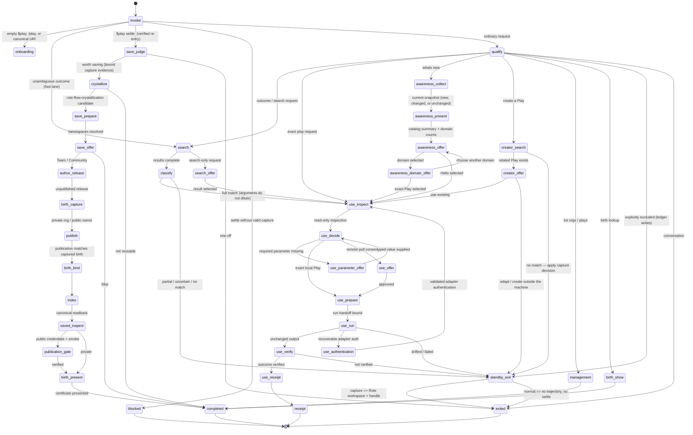

# Play

**Reuse work that already works—without giving up visibility or control.**

Play is a sidekick for Codex, Claude Code, Kimi, Cursor, Hermes, OpenCode, and DeepSeek Harness.
Before your agent starts a task, Play
checks whether a saved procedure already produces the result you want. If one fits, you can inspect
it and approve the exact run. If none fits, Play gets out of the way and your agent works normally.
When that work turns out to be useful again, Play can help save it for next time.

You do not need to learn a workflow language or replace your agent. Ask for outcomes in ordinary
language.

## New here? Start in five minutes

### 1. Know the three names

- **Play** is this sidekick. It finds, explains, runs, and saves reusable procedures.
- A **Play** is one saved, inspectable procedure—for example, “retrieve recent emails” or “deploy
  staging and post a summary.”
- **Rote** is the local engine that runs Plays and connects them to tools and APIs. Your credentials
  stay on your machine.

The docs sometimes say **harness**. That simply means the agent app you use, such as Codex or
Claude Code.

### 2. Install on a new machine

On macOS or Linux, run:

```bash
curl -fsSL https://getrote.dev/playoffs/install.sh | sh
```

That is the whole setup. The installer opens a small terminal wizard: press Enter for a concise
guided walkthrough, or choose **Review details** to inspect every planned change. Play finds your
agent apps, checks Rote and its skills, and explains what it will install, update, or refresh. One
approval covers the displayed setup, including the official Rote installer when Rote is missing.
Before changing Play-owned harness state, the wizard verifies the current Rote identity and, when
needed, asks whether to continue with Google or GitHub. The browser OAuth flow signs in or creates
the account; the installer then builds and fingerprints the public Play catalog used by **What’s
New** before activating any harness.
For Codex and Claude Code, it keeps an already-current Play plugin and refreshes the marketplace
plus reinstalls only when the installed plugin is missing or stale.

The installer selects at most three apps per run. During execution, `◐ ◓ ◑ ◒` animate on one
progress line, `✓` marks completion, and `✗` marks failure. A short workflow-design insight rotates
above the progress line. Independent app integration and verification run in parallel. A warm
install with current Rote skills and Play plugins has a tested budget below five seconds; first-time
downloads and available updates remain bounded by network and provider CLI latency.

When it finishes, Play verifies the setup and tells you where it saved the report. Restart your
agent app, then continue to step 3. The installer requires Python 3.10+ and
[`uv`](https://docs.astral.sh/uv/); advanced options are in the
[installation reference](#installation-reference).

### 3. Say hello

Start a new conversation and invoke Play:

```text
$play         # Codex and Cursor
/play         # Claude Code, Hermes, OpenCode, and DeepSeek Harness
/skill:play   # Kimi Code
```

On first use, Play checks the local setup and guides you through Rote sign-in if needed. It then
offers **Run Hello**, a low-risk example that uses public data, needs no account credentials, and
declares no writes.

### 4. Try a real outcome

```text
$play find a Play that retrieves recent emails
/play run the PostHog daily active users report
/skill:play whats new
```

Before anything runs, Play shows the exact version, required inputs, local setup, credentials by
name, and declared effects. Choosing a search result is not approval to execute it; running is a
separate confirmation.

### 5. Capture useful work—or keep it normal

When no saved Play covers a likely reusable outcome, Play classifies it **before work starts**.
`capture` creates a Rote workspace and returns a capture handle; `normal` creates no trajectory and
can never be converted into a Play afterward. After captured work is verified, the agent may run:

```text
$play settle cap_xxxxxxxxxxxxxxxx deployed staging and posted the summary
```

Play checks that exact pre-work capture and its Rote evidence rather than guessing from the
conversation. Settle is optional, but it is never retrospective.

For a one-off task, just ask normally. When you want to guarantee that one request never enters the
Play machine, use the stateless direct prefix:

```text
direct: deploy this worker with wrangler
```

`without play:` is an equivalent spelling. The bypass applies only to that request and does not
disable harness permissions, safety checks, or tool approvals. A later explicit `$play` invocation
works normally.

## What happens when you use Play?

| You do this | Play does this | You stay in control of |
|---|---|---|
| A hook detects a relevant Play or repeatable outcome | Searches your local and authorized Play collections | Whether to inspect or ignore a match |
| Prefix a request with `direct:` | Stays out completely: no machine, search, capture, or preference write | The direct task and its normal harness permissions |
| Inspect a matching Play | Shows inputs, setup, credentials by name, and declared effects | Whether the exact version may run |
| No adequate Play exists | Classifies the fallback as capture or normal before execution | Whether captured work should later settle |
| Finish repeatable work | Checks whether the recorded steps are worth saving | Team, Community, or Skip |
| Ask “what’s new” | Shows new and revised Plays grouped by organization | Whether to inspect one |

Play is designed to be quiet. The prompt hook is the proactive activation gate: conversation,
creative work, one-off tasks, and requests that receive no Play activation line continue without
entering the Play machine. You can also teach it scoped preferences such as “no Plays while I’m
prototyping” or “always offer Plays for deploy chores.”

## Safety and privacy at a glance

- Nothing runs merely because search found a match.
- Setup has one explicit approval; later, every exact Play run keeps its own approval boundary.
- Credentials stay in Rote’s local stores; Play reports credential names, never secret values.
- Play fails closed when a version, receipt, declared effect, or publication check does not match.
- Owner-private state lives under `~/.rote-play/`; Rote’s execution state remains under `~/.rote/`.
- The cross-harness bootstrap preserves unrelated hooks and creates backups before changing
  supported hook files.

## Common commands

```text
$play                                      # Guided introduction
$play find a Play that retrieves emails   # Find by outcome
$play run the PostHog DAU report           # Find, inspect, then approve a run
$play whats new                            # Open your Play inbox
$play settle <capture-handle> <summary>    # Settle an existing Rote capture
$play birth weekly customer report         # See how one of your Plays was made
$play list my organizations and Plays      # Browse authorized collections
play cheat-sheet                           # Learn Play through short example interactions
direct: <request>                           # Bypass Play for exactly one request
play-routing --project . list               # Inspect this repository's direct routes
```

That is enough for everyday use. Jump to the section that matches what you need next:

- [Installation reference](#installation-reference)—marketplaces, source checkouts, updates, and
  multi-harness bootstrap.
- [Everyday Play commands](#everyday-play-commands)—searching, running, saving, the inbox, and birth
  certificates.
- [Architecture and internals](#architecture-and-internals)—the state machine and typed runtime.
- [Development checks](#development-checks)—package, test, benchmark, and UI validation commands.

## Architecture and internals

Play stays predictable by making each layer own one job:

| Layer | Responsibility |
|---|---|
| **`SKILL.md`** | Teaches an agent how to enter the runtime and handle its next boundary. |
| **`play-machine`** | Owns search, inspection, approval, execution control, verification, saving, and fail-closed behavior. |
| **Rote skills** | Own setup, tools, browsers, adapters, workspaces, authoring, and publication. |
| **Rote CLI and registry** | Run exact Plays locally and distribute authorized Plays. |

The following sections are primarily for maintainers and integrators.

### The Play state machine

Play is driven by one declarative machine,
[`references/controller/machine.yaml`](references/controller/machine.yaml) (`play.machine/v1`).
The typed runtime loads and validates the bundle once per invocation, executes eligible
deterministic actions until a model, human, specialist, or terminal boundary, and accepts only
events declared by [`actions.yaml`](references/controller/actions.yaml) and
[`prompts.yaml`](references/controller/prompts.yaml). It never jumps states from conversational
intuition. Initial state: `invoke`. Terminals: `receipt`, `completed`, `exited`, `blocked`.



(The diagram groups the onboarding, team-invite, authentication, and publication sub-chains for
readability; [`machine.yaml`](references/controller/machine.yaml) is the exact authority.)

There is deliberately **no Explore lane**. Earlier versions of this machine orchestrated
exploration — modality routing, adapter discovery, effect approvals — re-implementing what the
rote skills already own. Today, when no adequate Play exists, Play classifies the fallback before
execution. Captured work starts in a dedicated Rote workspace and may later settle by its explicit
handle; normal work has no capture and no retrospective save path.

The runtime enforces this boundary rather than relying on caller prose: continuation state is
resumed only by owner-private opaque IDs; boundary events reject undeclared fields; settle guards
are derived from the bound capture; private-org policy is derived from membership evidence; the
machine is checked against its Draft 2020-12 schema before semantic validation; approved Play runs
inherit a 3600-second budget; and oversized output streams to an owner-private artifact with only a
bounded preview in the continuation.

State ownership is explicit: `play` owns invocation classification, prompts, evaluators,
deterministic verification, and the standby/ledger writes; `rote-specialist` states
(`crystallize`, `author_release`, publication, `management_list`, team/org actions) are delegated
through typed `play.handoff/v1` packets and validated `play.handoff-receipt/v1` receipts;
`flow-runtime` owns `saved_inspect`, `publication_credentials`, and `publication_smoke` via
first-class Rote surfaces. `tests/controller/test_machine_conformance.py` fails when the machine,
actions, prompts, or the thinking-orbs presentation mapping drift.

Three evaluator (model) boundaries remain in the whole machine: request qualification (ledger-
aware), creator classification, and the save-worthiness judgment. An adequate local Play with
bound parameters runs with **zero** model and zero human yields — one runtime call to the receipt.

### Typed controller runtime

The executable controller lives in
[`scripts/lib/play/controller.py`](scripts/lib/play/controller.py). It compiles the authoritative
Play YAML into [`python-statemachine`](https://python-statemachine.readthedocs.io/) 3.2, while
retaining Play's machine, action, prompt, context, and handoff contracts as the source of truth.
The runtime provides typed cursors and events, context-schema validation, bundle-SHA binding,
derived guards, mutation semantics, checkpointed `play.context/v1`, terminal enforcement, and
per-step timing. [`runtime_actions.py`](scripts/lib/play/runtime_actions.py) executes safe
deterministic commands without shell interpolation and loops until the next evaluator, prompt,
specialist, or terminal boundary.

The automatic runner owns every deterministic action state. The harness sees only model judgments,
human prompts, exact Rote specialist handoffs, and terminal results. The complete context is
checkpointed in an owner-private, 24-hour continuation store under `~/.rote-play/continuations`;
stateless CLI calls exchange only a random 24-character continuation ID.

Install the locked dependencies and inspect the compiled bundle:

```bash
uv sync
uv run scripts/bin/play-machine describe --json
printf '%s' '{"run_id":"demo","task_key":"demo","request":{"original":"Review this repository"}}' \
  | uv run scripts/bin/play-machine run-until-yield --stdin --json
```

Measure controller-only latency with `just benchmark-controller` and `just benchmark-runtime`.
The 2026-08-07 baseline (Apple Silicon, Python 3.14.5, then 87 states) recorded one-time compile
at 76–82 ms, warm transitions at 0.58 ms median / 0.78 ms p95, and the full invoke-to-evaluator
loop at 54 ms; the machine has since shrunk to 70 states and the ~4 KB activation skill replaced a
34.9 KB model-owned controller manual. Treat these as development baselines, not cross-machine
guarantees.

## Installation reference

### Install Play everywhere

Use the same command on a new machine or to bring an existing installation up to date:

```bash
curl -fsSL https://getrote.dev/playoffs/install.sh | sh
```

The wizard offers two views of the same safe plan:

- **Guided setup** is the default: a short summary of Rote, the selected apps, and the three setup
  phases.
- **Review details** shows detected apps, Rote status, skill changes, hooks, and every planned action.

Nothing changes until you approve the selected view. The plan includes:

- the detected Codex, Claude Code, Kimi, Cursor, Hermes, OpenCode, and DeepSeek Harness installations;
- whether Rote is missing, current, or has an update available;
- whether Rote skills need to be installed or refreshed in each selected app;
- the Play installations and hooks it will configure.

After approval, it performs that plan, verifies each selected app, and saves a JSON and Markdown
report under `~/.local/state/play-bootstrap/runs/`. The final status card gives each app's launch
command, exact Play invocation, any remaining action, and a few starter prompts. Full structured
command output stays in the saved JSON report; the terminal shows bounded human summaries unless
you explicitly pass `--json`. In a terminal, one short workflow-design insight rotates above one
active progress line: `◐ ◓ ◑ ◒` animate while active, `✓` means completed, and `✗` means failed. The notes emphasize immediate
value, real recurring needs, low review cost, and permission to redesign or retire experiments.
Redirected output gets one start and one finish record per phase without rotating copy or repeated
elapsed-time heartbeats.

Identity is an early setup gate. If Rote is unsigned, the terminal wizard offers Google and GitHub
before any Play-owned backup, plugin, skill, or hook is changed. OAuth login also creates a new
account when the provider identity has not been seen before. A non-interactive install without an
authenticated profile or explicit provider pauses at **SETUP PAUSED — SIGN IN REQUIRED**; rerun it
with a terminal or provide `PLAY_LOGIN_PROVIDER=google|github`. The harness identity lane remains an
authentication path for sessions that expire or are revoked later. Managed activation also restores a
launcher whose recorded Play source no longer exists; it will not take over a different source that
is still present.

Invocation differs by app:

| App | Start | Invoke Play |
|---|---|---|
| Codex | `codex` | `$play` |
| Claude Code | `claude` | `/play` |
| Kimi Code | `kimi` | `/skill:play` |
| Cursor | Open Cursor | `$play` |
| Hermes Agent | `hermes` | `/play` |
| OpenCode | `opencode` | `/play` (installed as a managed command bridge) |
| DeepSeek Harness (developer preview) | `dsh web` | `/play` |

A successful guided install ends at **step 1** on the path to becoming a Playmaster and prints a
copy-paste first prompt. Start the mind-meld with either supported interactive CLI directly:

```bash
codex "\$play what's new"
claude "/play what's new"
```

These launch a new harness conversation with the discovery request already entered.

### Choose which apps receive Play

By default, Play selects the top three detected apps. To choose explicitly:

```bash
curl -fsSL https://getrote.dev/playoffs/install.sh \
  | sh -s -- --harness codex --harness claude
```

Repeat `--harness` up to three times with any of `codex`, `claude`, `kimi`, `cursor`, `hermes`,
`opencode`, or `deepseek`. A larger selection fails before changes. DeepSeek Harness is still a
developer preview upstream.

### Run unattended

The simple command above is the only command people need. CI has no controlling terminal, so
automation must record both approvals explicitly: the displayed Play plan and, when Rote may be
missing, its official installer. A first-time unattended installation must also select the OAuth
provider explicitly.

```bash
curl -fsSL https://getrote.dev/playoffs/install.sh \
  | env PLAY_INSTALL_YES=1 PLAY_APPROVE_REMOTE_INSTALLER=1 \
      PLAY_LOGIN_PROVIDER=github sh
```

Omit `PLAY_APPROVE_REMOTE_INSTALLER=1` when Rote is known to be installed, and omit
`PLAY_LOGIN_PROVIDER` when that profile is already authenticated. Set `PLAY_INSTALL_TOP_K=<n>` from
1 through 3 to change the default number of selected apps.

### Full Play + Rote bootstrap

From a checkout, run the same guided bootstrap directly:

```bash
scripts/bin/play-bootstrap install --top-k 3
```

To separate review from execution, first create a read-only plan:

```bash
scripts/bin/play-bootstrap plan --top-k 3
scripts/bin/play-bootstrap plan --top-k 3 --json
```

Then apply its exact ID:

```bash
scripts/bin/play-bootstrap apply --top-k 3 --plan-id sha256:<plan-id>
```

Add `--approve-remote-installer` only after approving the official Rote download. The bootstrap is
safe to retry: it updates Rote only when an update is available, installs missing Rote skill
providers, and skips already-current Play marketplace plugins. Outdated Codex and Claude plugins
are refreshed and reinstalled in parallel; managed hooks and per-app preflight verification are
also parallelized. It preserves unrelated hooks and backs up every hook file it changes. An
explicitly disabled Codex Play skill remains a user choice: the report asks you to enable it in
`/skills` before restarting. Reports never contain credentials.

### Pin or inspect the installer

Pin both the script and downloaded archive to the same release:

```bash
curl -fsSL https://raw.githubusercontent.com/modiqo/play/v0.4.13/install.sh \
  | env PLAY_INSTALL_REF=v0.4.13 sh
```

To inspect the small bootstrap before running it:

```bash
curl -fsSLo /tmp/install-play.sh \
  https://raw.githubusercontent.com/modiqo/play/main/install.sh
less /tmp/install-play.sh
sh /tmp/install-play.sh
```

### Install from a checkout

```bash
just package
just plan
just install
just verify-profile
```

`just install` links the checkout, so edits become live after a harness restart. `just install-copy`
exercises the durable-copy path used by the curl installer.

## Install from a marketplace

Play is packaged as one self-contained plugin under `plugins/play`. The package includes the skill,
controller references, Python runtime, harness activation tools, and the `justfile` recipes that
configure and verify the Play-first experience. `scripts/bin/package-plugin --check` prevents those
installed files from drifting from this repository's source of truth.

The Rote skill provider is a prerequisite so Play can hand missing local installation to the
guided `rote-setup` specialist:

```bash
# Codex
codex plugin marketplace add modiqo/rote-skills
codex plugin add rote-onboard@rote-skills

# Claude Code
claude plugin marketplace add modiqo/rote-skills
claude plugin install rote-onboard@rote-skills
```

After Play is installed, the `play-machine` launcher is on `PATH`; harnesses invoke it directly
without locating the skill directory or its Python environment. `play-machine` is a Python
entrypoint, not a compiled artifact: the installer writes a small executable launcher that uses the
pinned environment (bootstrapping through `uv` when needed). The preflight distinguishes a missing
launcher, an incomplete bundled runtime, an unavailable Python environment bootstrap (`uv` or an
already active pinned environment), a missing Rote CLI, missing Rote skills in the active harness,
authentication, and `rote play` capability; it also reports cross-harness coverage and
multi-select restoration targets. An empty `$play` or `/play` probes
the local binary and identity. If either
is missing, Play invokes `rote-setup`; that specialist asks before downloaded installer code, login,
credentials, or optional onboarding. Ordinary requests are lexically classified and qualified
first; only Play-bound evaluator events run the full preflight, so excluded conversation and
repository work do not pay the identity/capability probe.
Public Play URIs can still show their read-only public card before the CLI exists.

Marketplace installs restore this launcher automatically from Play's session-start hook. If a
harness cached or enabled the plugin without completing activation, `$play` also runs the bundled
`scripts/bin/play-activate` and continues through the bundled runtime in the same turn. This works
before Rote skills are present; later sessions converge Rote skills discovered in Codex or Claude
plugin caches. In Codex, an explicitly disabled Play skill remains a user preference: open
`/skills`, enable Play, and restart the session.

Install Play from its public marketplace after Rote setup:

```bash
codex plugin marketplace add modiqo/play
codex plugin add play@play-skills

claude plugin marketplace add modiqo/play
claude plugin install play@play-skills
```

This checkout is also a valid local marketplace:

```bash
# Run from this repository root.
codex plugin marketplace add .
codex plugin add play@play-skills

claude plugin marketplace add .
claude plugin install play@play-skills
```

The public marketplace source is `modiqo/play`, so `.` can be replaced with that GitHub
`owner/repository` from outside this checkout. The guided installer converges the separately trusted
Rote skill distribution before reinstalling Play; every harness still uses the same runtime
preflight because plugin metadata alone cannot prove CLI installation or login state.

### Skill-directory harnesses

Kimi, Hermes, OpenCode, and DeepSeek Harness have no Play plugin marketplace. The installer uses
their native personal skill roots (and shared `~/.config/agents/skills` or `~/.agents/skills` where supported), then installs
the invocation surface each app expects. For OpenCode, that includes a managed global `/play`
command because its standard skill surface is tool-driven rather than a direct slash command.
Install Play for them from this checkout with:

```bash
just plan
just install
```

`install` discovers every supported local harness and every skills root containing Rote skills —
including `~/.agents/skills` — links this Play skill into each, and applies the activation metadata in
[`agents/openai.yaml`](agents/openai.yaml) (`allow_implicit_invocation: true`) so Play stays
implicitly invocable and the rote specialists remain model-invocable for chained handoffs. Play's
structured prompts map to Kimi's `askquestion` control
(`scripts/bin/play-question <prompt> --harness kimi`), and `just harness kimi` /
`just smoke kimi` start and smoke-test the harness like Codex and Claude Code.

Restart the harness after plugin installation. On first use, Play runs the bundled preflight. To
make Play the preferred implicit entrypoint while keeping installed `rote` specialists
model-invocable for chained handoffs, preview
and apply the bundled reversible activation profile from the installed skill directory:

```bash
just plan
just install
just verify-profile
```

In marketplace mode this profile does not create a second Play link. It snapshots and updates the
activation metadata of discovered `rote` skills so the harness can follow chained handoffs.
Uninstall restores those exact snapshots and fails closed if a managed file was subsequently
changed.

## Update an installed Play plugin

After a new Play release is pushed, refresh the marketplace snapshot and reinstall/update the
plugin. Published changes must carry a new plugin version; a push that keeps the same version is not
a reliable cache invalidation mechanism.

For Codex:

```bash
codex plugin marketplace upgrade play-skills
codex plugin remove play@play-skills
codex plugin add play@play-skills
```

For Claude Code:

```bash
claude plugin marketplace update play-skills
claude plugin uninstall play@play-skills --scope user
claude plugin install play@play-skills --scope user
```

Restart the harness and start a new conversation after updating so it loads the refreshed skill. If
you enabled the implicit Play-first profile, run the following from the newly installed Play skill
directory to converge its reversible activation metadata after the plugin refresh:

```bash
just install
just verify-profile
```

Skill-directory harnesses have no Play plugin cache to upgrade; rerun the installer to refresh
their personal skill links and integrations. If you use a cloned source
checkout instead of the GitHub marketplace — or need to refresh those AGENTS.md roots — update from
the repository root with:

```bash
git pull --ff-only
just package
just update
```

Then restart the harness and begin a new conversation. `just package` refreshes the self-contained
marketplace payload; `just update` safely reapplies and verifies the source-linked Play-first
profile.

## Enable from a source checkout

Preview every harness root and canonical rote skill that will change:

```bash
just plan
```

Activate the Play-first profile and verify it:

```bash
just install
just verify-profile
```

After editing the source skill, confirm that every source-linked installation is still valid:

```bash
just update
```

The links make source edits live immediately; a running harness must still be restarted to reload
the revised skill.

`install` detects Codex, Claude Code, Kimi, and Cursor, discovers their skill roots containing
`rote` or `rote-*`, links this Play skill into each root, and makes every Rote skill model-invocable so specialist handoffs can
continue without another user command. It snapshots the original Rote activation files so the
change is reversible. Restart running harnesses after enabling the profile.

It is also the convergence command after `rote harness setup`, a plugin refresh, or a newly added
harness. If Rote replaced managed skill files, `just install` preserves those refreshed files as the
new uninstall baseline and reapplies only Play's activation metadata. It adds new roots/skills and
retires removed ones without restoring stale backups. A changed or conflicting Play link still
fails closed.

Inspect the active profile at any time:

```bash
just status
just status-roots
```

## Start and test a fresh harness

Start a supported interactive harness after verifying the profile:

```bash
just harness codex
just harness claude
just harness kimi
```

Start a compact Codex session without changing global Codex configuration:

```bash
just harness-quiet
```

This launch sets `model_verbosity="low"`, `model_reasoning_summary="none"`, and
`hide_agent_reasoning=true` as per-session overrides. It reduces model narration and reasoning
events; the Codex UI may still render tool calls that were actually made.

Run a read-only smoke test that must reach Play's search-and-step-aside boundary:

```bash
just smoke codex
just smoke claude
just smoke kimi
```

Run every locally installed supported smoke-test harness with:

```bash
just smoke-all
```

Smoke tests start new harness processes and may consume model credits.

## Everyday Play commands

Find by outcome across local and authorized remote indexes:

```text
$play find a Play that retrieves recent emails
$play search live status for AI services
$play run the PostHog DAU report
```

For a vague `run` request, Play searches and offers recognizable names. For an exact reference, it
skips search but never skips inspection or approval. A registry-only result is labeled as available
in an authorized organization and expected to need a local pull/install. The first-class run later
performs that convergence after approval; Play does not manually assemble pull and Flow commands.

List organization and registry inventories:

```text
$play list orgs
$play list plays
$play list
```

Create, save, and share without memorizing lifecycle commands:

```text
$play create a reusable weekly customer report
$play settle cap_xxxxxxxxxxxxxxxx built the weekly customer report end to end
direct: deploy this worker with wrangler
```

Play always searches before creating. If an adequate Play exists it offers **Inspect existing**.
If none exists, the request is classified before execution. A capture starts and binds a Rote
workspace; normal work remains uncaptured. Only `$play settle <capture-handle> <summary>` can
re-enter the save path, and the save-worthiness judge examines the **bound trace, not the
conversation**: at least two effect-bearing steps, at least one input that would vary on reuse,
and a stable output shape.
A worth-saving verdict leads to one offer:

- **Team** — release and publish to an authorized private organization, then offer colleague
  invites through `rote-org`;
- **Community** — release and publish under a selected public owner, verify associated adapter
  credential contracts, then run the exact public URI once from an isolated directory;
- **Skip** — keep the result without publishing or indexing a Play.

Execution ownership stays with the rote skill suite end to end: crystallization with
`rote-flow-crystallization`, release with `rote-flow-authoring`, publication with `rote-registry`.
Play never re-implements those flows; it validates each specialist's typed receipt and blocks on
mismatch — a specialist cannot claim success in prose.

One save-time caveat Play discloses honestly: browser-derived (DRIVE) work has a crystallization
limit. Typed browser steps carry navigation, waits, clicks, typing, and canonical extract slices
only; an outcome whose required facts exceed those slices can crystallize only as a legacy stepless
body, which `rote play run` rejects (`play_run_eligible: false`) — a publication gate requiring
explicit approval. See the
[DRIVE crystallization limit](references/explore/modalities.md) and the
[RCA that motivated it](docs/rca/2026-08-05-drive-crystallization-not-play-run-eligible.md).

After release, Play captures a private birth certificate from the exploration evidence. After
Private or Public publication, it binds that certificate to the minted exact reference, then indexes
and inspects the canonical version before calling the save successful. The final typed Python
renderer frames the verified certificate with the Play URI, X and LinkedIn copy for Public Plays,
and a redacted trace-learning summary showing explicit successes, errors, and unknown outcomes. It
closes with a personalized thank-you to the human domain expert. Organization membership,
invitations, and sharing use the organization/list surface rather than hidden local state.

Release and publication are deliberately separate specialist handoffs. `rote-flow-authoring` must
stop after an explicitly unpublished local release. Play then captures the immutable birth object,
and only a fresh `rote-registry` handoff may publish that exact artifact while echoing the captured
birth SHA. If a broad registry publication request publishes early, the machine emits
`publication_boundary_violated` and blocks instead of treating a registry summary as completion or
offering a retrospective certificate.

Public namespace resolution also happens before release. The typed
[`play-public-owner`](scripts/bin/play-public-owner) probe reads the claimed Rote profile handle and
authorized organizations, distinguishes those two identity kinds, and inserts a bounded summary
into the save prompt. Public owner selection is completed before `author_release`; a later generic
CLI hint to claim a handle cannot trigger a redundant `rote profile set-handle` attempt. If the
probe is unavailable, Private and Skip remain available while Public fails closed.

### Public credential and canonical-run gate

A successful registry push is not enough for a Public Play. After canonical readback, Play uses
[`scripts/bin/play-publication-gate`](scripts/bin/play-publication-gate) to compare every associated
adapter across three Rote-owned views:

- the exact Play resolver's selected source, credential demand, and receipt status;
- the installed adapter's version, fingerprint, auth family, and credential binding names;
- the selected registry adapter's published version, fingerprint, and auth contract.

Source/provenance, version, fingerprint, auth family, and environment-variable names must agree.
This deliberately catches contracts such as local `GITHUB_API_TOKEN` versus published `GH_TOKEN`
even when the two adapters have the same fingerprint. The checker handles static credentials and
OAuth-family metadata, but never reads, hashes, prints, copies, or persists a token value.

Only after that metadata check passes does Play invoke exactly one
`rote play run <registry-returned-versioned-uri> <verified-parameters> --yes` from a fresh temporary
working directory under `/tmp`. The temporary directory is removed afterward. Controller context
retains only status, hashes, byte count, and elapsed nanoseconds—not the smoke run's primary output.
This proves that the canonical URI resolves and runs with the current host's Rote/credential setup;
it does not prove every consumer already has the required credentials.

A mismatch, missing credential, provenance failure, or unsuccessful run blocks Play-page links,
social copy, and congratulations. The gate does not silently pull or republish an adapter, change
`token_env`, authenticate, delete transaction backups, or retry. Remediation stays with the
appropriate Rote skill, after which the canonical gates run again. See the
[GitHub token-env incident RCA](docs/rca/2026-08-06-github-token-env-var-confusion.md).

Open or verify how one of your Plays was born:

```text
$play birth weekly customer report
$play show how modiqo/weekly-customer-report was born
scripts/bin/play-birth show modiqo/weekly-customer-report@1.0.0
scripts/bin/play-birth list --json
scripts/bin/play-birth verify weekly-customer-report --json
scripts/bin/play-birth capture --workspace weekly-report-build --flow weekly-customer-report --json
scripts/bin/play-birth bind <birth-sha> --reference modiqo/weekly-customer-report@1.0.0 --json
```

Birth certificates live under `~/.play/births`, independently of `.rote`. They are readable only by
the local OS user, content-addressed, and captured once per released Flow fingerprint. They preserve
safe counts, explicit success/error/unknown outcomes, timings, dependency edges, modalities, token
savings, artifact hashes, and the minted URI’s registry-supplied publication author provenance while
excluding raw commands, parameters, queries, responses, credentials, and workspace paths. They are
not uploaded to the registry and do not follow a Play to another machine. See
[`references/publish/birth.md`](references/publish/birth.md) for capture, binding, privacy, and
lookup semantics. Normal users need only `$play birth …`; capture and bind are controller-owned
lifecycle commands shown here for diagnostics and integration testing.

Open the externally read-only Play inbox:

```text
$play whats new
$play whats new this week
$play digest                       # compact command alias
scripts/bin/play-digest --remember --days 1 --json
scripts/bin/play-digest --since 2026-08-03T00:00:00Z --json
scripts/bin/play-digest --checkpoint host-checkpoint.json --json
scripts/bin/play-digest --org modiqo --days 7 --json
scripts/bin/play-public-trends --play modiqo/hello@0.2.0 --json
scripts/bin/play-public-trends --org modiqo --workers 8 --json
```

“What’s new” is a stepwise discovery funnel, not a wall of Play cards. On the first view it begins by
congratulating the user for taking the first step. It then reports the live, coverage-aware count of
runnable public Plays visible through the user’s authorized organizations, lists each organization
with its Play count, and asks the user to choose a domain. Only then does it reveal a bounded short
list of Plays in that domain. Hello remains the recommended low-risk first move.

Public JSON cards are fetched concurrently and grouped by their declared organization or user owner
kind. The total is derived from inspected runnable cards, never hard-coded: complete coverage uses an
exact count; partial coverage says “at least.” Registry and public cards do not currently expose run
counts or windowed counter changes, so the UI never calls cumulative totals runs or trending activity.
The reusable report records per-card and batch fetch latency.

Selecting a card enters read-only inspection before execution approval. Publication authors are
display metadata; Play does not equate an author string with the current signed-in identity. Ranking
scope and missing global, run, or personal metrics are explicit rather than inferred. The emitted
checkpoint token can be persisted by an authorized host for gap-free daily delivery; the command
does not write host state unless `--remember` is explicit.

On normal `$play whats new` requests, Play uses remembered mode. It stores only a stable awareness SHA,
UTC checkpoint, and authorized-scope contract in `~/.rote-play/digest-state.json`. If the current
snapshot has the same SHA, Play says nothing changed and still presents the current catalog summary
and domain choices. The moving time window is excluded from the SHA, and no inbox contents or
credentials are stored.

### The zero-token inbox and structural hooks

The inbox also has a proactive, zero-token surface. A background refresh caches both tiers —
a precomputed one-line summary and the full digest with rendered markdown — plus the authorized
hub catalog, under `~/.rote-play/inbox-cache.json`:

```bash
play-inbox refresh --if-older-than 6   # background-job body; skips when fresh
play-inbox line                        # instant; prints one line or nothing
play-inbox details                     # cached full inbox, no network
```

Wire it stale-while-revalidate at session start (no daemon or cron): the hook serves the previous
refresh instantly and detaches the next one. The line counts only unseen items — the interactive
digest owns the acknowledgment checkpoint, so viewing "what's new" quiets the banner on its own.

The same hook surface carries the interception loop:

```bash
play-intercept prompt        # UserPromptSubmit: local + hub-catalog match, one line or silence
play-intercept settle-nudge  # Stop: one reminder per armed save hook per session
```

The hook is the sole proactive activation gate. It emits nothing for `direct:` and `without play:`
requests, so those requests do not load the Play machine even when a saved Play would otherwise
match. Silence for any other request likewise means normal harness execution; the skill does not
self-enroll an ordinary outcome.

Before matching catalog tokens, the hook requires an action-shaped request. A design question such
as “should we use GitHub Actions?” stays silent even if a GitHub Play exists. Actual actions can be
routed directly through a user or project policy:

```yaml
# .play/routing.yaml
schema: play.routing/v1
routes:
  - id: github-direct
    strategy: direct
    providers: [github, github-actions]
    tools: [git, gh]
    executors: [api, cli]
  - id: cloudflare-direct
    strategy: direct
    providers: [cloudflare]
    tools: [wrangler]
    executors: [api, cli]
```

A matching `direct` route suppresses Play activation only; normal harness permissions, credential
boundaries, and safety checks still apply. Policies cannot contain command templates, arguments,
endpoints, or credentials. Invalid policies authorize nothing and fall back to ordinary Play
matching.

Global install creates an empty owner-private policy at `~/.rote-play/routing.yaml`; it deliberately
does not modify whichever repository happened to launch the installer. Manage that user policy or
an explicit project policy with the bundled Python CLI:

```bash
play-routing --user list
play-routing --project . init
play-routing --project . add github-direct \
  --provider github --provider github-actions --tool git --tool gh \
  --executor api --executor cli
play-routing --project . add cloudflare-direct \
  --provider cloudflare --tool wrangler --executor api --executor cli
play-routing --project . remove github-direct
play-routing --project . list --json
```

The same operations are available through natural-language Play requests without entering the
state machine. An unqualified initialization defaults to the current repository:

```text
Initialize Play routing for this repo
Route GitHub directly through gh in this project
Show this project's Play routing policy
Stop routing GitHub directly here
```

Only explicit user/global wording selects `~/.rote-play/routing.yaml`.

`add` replaces a route with the same ID, `remove` fails when the ID is absent, and `init` is
idempotent without overwriting existing policy. The nearest `.play/routing.yaml` inside the current
Git worktree augments the user policy.

Hook state (index cache, cooldowns, nudge markers, preference ledger, standby hooks) lives in
shared `~/.rote-play/` stores, so the safeguards compose across harnesses: a Play saved from one
harness is an interception candidate in every other, and nudges never double-fire. Preference
resolution is specificity ordered (`session` over `project` over `global`); a non-global entry must
carry its exact scope key and cannot silently widen to other sessions or projects.

Cache lifecycle: setup synchronously builds a complete, canonically ordered public catalog after
identity verification and records its stable SHA-256 fingerprint in the bootstrap receipt. **What’s
New** therefore has a zero-network first read when the harness starts. Session start refreshes only
when the cache is older than six hours — no cron or manual sync — and keeps the last verified
snapshot if a maintenance refresh cannot reach the registry. The cache stores exact references,
release metadata, labels, and tags when the registry exposes them; digest acknowledgment remains a
separate state so refreshing never marks an item as viewed.

Recurring delivery is optional and must be explicitly requested. Its host-neutral two-phase
contract remains available for an authorized scheduler:

```bash
scripts/bin/play-scheduler-probe
scripts/bin/play-delivery prepare --target-key daily-self --channel harness --days 1
scripts/bin/play-delivery release --envelope envelope.json --ack delivered-ack.json
```

The host scheduler owns recurrence, destination delivery, and storage. `prepare` emits an immutable
envelope with a deterministic delivery ID; `release` emits the next checkpoint only for a matching
successful acknowledgment and never persists it. Failed sends therefore leave the prior checkpoint
unchanged. Play never installs or fabricates a scheduler as part of an on-demand digest request.

Search normalizes punctuation and repeated terms, runs both sources concurrently, deduplicates
aliases and versions by canonical Play reference, and shows a URI, local availability, and the next
read-only inspection command for every registry-addressable result.

The organization view shows active member, private Play, public Play, and total counts. The Play
view groups private and public Plays under each authorized organization. An ambiguous `$play list`
request presents both views as structured choices supported by the active harness.

For diagnostics or integrations, the same reusable building blocks are available directly:

```bash
scripts/bin/play-public-trends --play modiqo/hello@0.2.0 --json
scripts/bin/play-search recent emails --json
scripts/bin/play-inspect warsaw-rust/posthog-dau-report@0.0.3 --json
scripts/bin/play-run --stdin --json
scripts/bin/play-run-output --stdin --json
scripts/bin/play-inventory --json
scripts/bin/play-handoff prepare --stdin --json
scripts/bin/play-handoff verify --stdin --json
scripts/bin/play-birth show weekly-customer-report --json
scripts/bin/play-birth verify weekly-customer-report --json
scripts/bin/play-question approve_play_run --harness codex
scripts/bin/play-question approve_play_run --harness claude
scripts/bin/play-question approve_play_run --harness kimi
```

The question command maps the same prompt and event contract to Codex `request_user_input`, Claude
and Kimi `askquestion`, or a numbered Markdown fallback. `play-inspect` normalizes the complete
`rote play inspect <reference> --json` result into a stable disclosure. After approval, the
controller passes the bound inspection and approval packet to `play-run`. That universal runner
performs exactly one `rote play run <canonical-uri-or-exact-reference> <approved-parameters> --yes`
and emits the typed controller event. It does not delegate execution to a prose skill, rediscover
the Play, resolve a local path, replay the command to capture output, or ask the harness to construct
a receipt.
Unambiguous outcome verbs route directly from invocation to parallel Play search without a model
qualification or harness preflight round trip. Canonical URIs accept explicit `key=value`
parameters; inspection deterministically elicits any remaining required values before pull consent.
It uses `rote play` for local Play operations and `rote registry play` for registry distribution and
registry-scoped discovery. It never uses legacy Flow command aliases or decomposes a failed Play
operation into a manual pull-plus-run fallback.

### Unchanged run output

Successful Use-mode execution passes the complete primary payload directly from `use_run` to
`use_verify`. Play retains the declared source, format, manifest, truncation flag, and full-output
reference but does not render or convert the payload. The harness owns presentation.

After verification, the receipt computes integrity and byte-count metadata over the unchanged
primary value and returns that same value to the harness. Compact or summary-only output cannot be
verified as a complete result; truncated output requires a full-output reference.

After a new Play is released, Play captures its owner-private birth object. After publication, it
binds the object to the registry content hash, indexes the Play, reads the canonical registry entry
back with JSON inspection, verifies its owner/version/visibility, and only then presents the typed
certificate and reports success. A `play_published` event alone is always intermediate.

## Optional thinking-orbs UI

React-capable hosts can use the adapter in `ui/thinking-orbs` to render
[`thinking-orbs`](https://orbs.jakubantalik.com/) from the authoritative Play machine state:

```bash
just ui-install
just ui-check
```

```tsx
import { PlayActivity } from '@modiqo/play-thinking-orbs';

<PlayActivity playState="creator_search" />
```

The mapping uses all nine animations for distinct trajectories: listening for declared prompts,
searching for discovery, solving for classification and verification, connecting for existing-Play
inspection/execution, weaving for multimodal exploration, shaping for crystallization, composing
for release/publication, working for result assembly, and breathing for paused terminal states.
Every machine state has exactly one accessible status label, and tests fail if the
machine and mapping drift.

The installed skill also teaches the agent to use the same presentation at meaningful milestones:

```bash
scripts/bin/play-presentation creator_search
# ◌ Peeking through the Play shelves…

scripts/bin/play-presentation use_run --json
# play.presentation/v1 payload for a capable host renderer
```

When a compatible MCP Apps/custom-UI host exposes a callable renderer, `PlayActivity` displays the
animated orb and message. Installing the skills-only plugin does not create that renderer. Codex CLI
and Claude Code text transcripts use the exact static glyph and message without claiming it is
animated. During the blocking `rote play run` command, Rote retains ownership of its own progress
display.

This is an optional host adapter, not a claim that a skill can replace native Codex, Claude Code,
Cursor, or Kimi activity chrome. Hosts without a custom React surface continue to receive Play's
milestone-only text updates. The adapter depends on `thinking-orbs` 0.2.0 from Jakub Antalik under
the MIT license; no upstream source is copied into this repository.

## Disable

Remove Play from every managed harness root and restore the exact original rote activation files:

```bash
just uninstall
just status
```

Restart running harnesses after disabling the profile. Uninstall fails closed if a managed Play
link was replaced or a rote activation file changed after installation; it will not overwrite the
newer content silently.

## Development checks

```bash
uv sync
just package
just package-check
just ui-check
just test
just benchmark-controller
just benchmark-runtime
```

The tests exercise the declarative Play machine and the complete activation lifecycle in temporary
harness roots, including installation, verification, idempotency, rollback, conflict handling,
parallel three-harness convergence, progress rendering, and the sub-five-second warm-install budget.

The foundation is Python-only. Commands under `scripts/bin/` and harness entrypoints under
`scripts/harness/` are thin executables; reusable command, private-store, birth-certificate,
registry, search, inventory, digest, templated elicitation, typed greeting/URI onboarding, typed
specialist handoff, typed controller runtime, public credential/smoke validation, and
machine-validation logic lives in `scripts/lib/play/`. References and tests are
grouped by controller, awareness, Explore, publication, integration, and harness use case.

For isolated testing, override the discovered roots or reversible state location:

```bash
PLAY_HARNESS_ROOTS=/path/one:/path/two just install
PLAY_PROFILE_STATE=/tmp/play-profile.json just install
```
