# Play

Play is the implicit pre-harness controller for reusable outcomes. It searches authorized Play
indexes first, runs an adequate Play in Use mode, or asks before entering Explore mode. The
existing `rote` and `rote-*` skills remain callable specialists that can hand off through Play.

## Start here

You do not need to remember organization/name slugs or lower-level rote commands. Describe the
outcome in ordinary language:

```text
$play
/play
$play https://play.modiqo.ai/chetan/list-my-github-repos@0.0.2
$play find a Play that retrieves recent emails
$play run the PostHog daily active users report
$play create a reusable weekly customer report
$play whats new
$play birth weekly customer report
$play list my organizations and shared Plays
Handle this normally without Play
```

Play keeps four decisions separate so each prompt is small and honest:

| You intend to… | Play does… | You choose… |
|---|---|---|
| Find something reusable | Search local and authorized organization indexes | Inspect one result or stop |
| Run a known or vaguely named Play | Resolve the name, inspect it read-only, and show setup/effects | Pull and run, or not now |
| Solve a one-off task | Search first; if no adequate Play exists, offer Explore | Explore with rote, or continue normally |
| Preserve successful exploration | Verify it before preparing a candidate | Private, Public, or Skip |
| See what’s new | Pull an inbox grouped by organization and compare it with the remembered SHA | Run, search, create, or finish |
| Revisit how a Play was born | Open the owner-private, redacted birth certificate | Choose an unambiguous name, reference, or birth SHA |

Search selection is never execution approval. Before every run, Play shows what the exact version
does, its parameters, adapters and credentials, what this machine must install or repair, declared
operations and writes, and any unknown effect semantics. Only the next structured choice can
authorize the exact inspected version and displayed parameters.

An empty `$play` or `/play` is a warm typed entrypoint. Play live-probes for Rote, reads the signed-in
email with `rote whoami`, and asks “How are you, `<email handle>`? What can I help you with?” Missing
or unauthenticated Rote is handed to the guided `rote-setup` skill. A public Play URI uses first-class
Rote inspection when available; without Rote, Play reads the URI's bounded public JSON card and
shows its own inspect and consent-gated install/bootstrap paths without executing them.

When Explore begins, Play resolves the signed-in human's email handle without retaining raw identity
output and welcomes them as the domain expert, with the agent as their apprentice. The welcome
explicitly invites the human to watch, question, and steer the work so their expertise can become
shared rote memory. It appears once after Explore consent and before any workspace is created; if
personalization is unavailable, Play uses the neutral `friend` fallback instead of inventing a name.

## The Play state machine

Play is driven by one declarative machine, [`references/controller/machine.yaml`](references/controller/machine.yaml)
(`play.machine/v1`). The controller re-reads it on every activation, executes exactly one declared
prompt or entry action per state, and accepts only events declared by
[`actions.yaml`](references/controller/actions.yaml) and [`prompts.yaml`](references/controller/prompts.yaml).
It never jumps states from conversational intuition. Initial state: `invoke`. Terminals:
`receipt`, `completed`, `exited`, `blocked`. Any action failure emits `action_blocked` and lands in
`blocked` (or, for a failed run, the `repair_offer` gate).

```mermaid
stateDiagram-v2
    direction TB
    [*] --> invoke

    %% ── Typed invocation and warm onboarding ──
    invoke --> onboarding_probe : empty $play or /play
    invoke --> onboarding_probe : canonical Play URI
    invoke --> qualify : ordinary request
    onboarding_probe --> onboarding_identity : greeting + Rote installed
    onboarding_probe --> onboarding_setup : greeting + Rote missing
    onboarding_probe --> use_inspect : URI + Rote installed
    onboarding_probe --> onboarding_card_fetch : URI + Rote missing
    onboarding_identity --> onboarding_welcome : authenticated email
    onboarding_identity --> onboarding_setup : login/setup required
    onboarding_setup --> onboarding_probe : setup completed; reprobe
    onboarding_setup --> blocked : paused / unavailable
    onboarding_welcome --> invoke : user describes need
    onboarding_card_fetch --> onboarding_card_present : card ready
    onboarding_card_present --> completed

    %% ── Qualify routes each request to one trajectory ──
    qualify --> search : outcome / search request
    qualify --> use_inspect : exact play request
    qualify --> awareness_collect : whats new
    qualify --> creator_search : create a Play
    qualify --> management_list : list orgs / plays
    qualify --> management_offer : ambiguous list request
    qualify --> birth_show : birth lookup
    qualify --> exited : conversation / excluded

    %% ── Search and adequacy ──
    search --> search_present : search-only request
    search --> classify : outcome request
    search_present --> search_offer
    search_offer --> use_inspect : result selected
    search_offer --> completed : dismissed
    classify --> use_inspect : full match
    classify --> explore_offer : partial / uncertain / no match

    %% ── Use (existing Play) ──
    use_inspect --> use_offer : inspected
    use_inspect --> completed : not runnable
    use_inspect --> search : reference unresolved
    use_offer --> use_run : approved
    use_offer --> completed : declined
    use_run --> use_output : run ready
    use_run --> repair_offer : drifted / failed
    use_output --> use_verify : detailed output ready
    use_output --> repair_offer : incomplete / summary only
    use_verify --> use_receipt : outcome verified
    use_verify --> repair_offer : not verified
    use_receipt --> receipt
    repair_offer --> explore_welcome : repair approved
    repair_offer --> exited : continue normally

    %% ── Explore (consent, route, delegated execution) ──
    explore_offer --> explore_welcome : explore approved
    explore_offer --> exited : continue normally
    creator_classify --> explore_welcome : create intent + no match
    creator_offer --> explore_welcome : adapt / create selected
    explore_welcome --> explore_prepare : human welcomed
    explore_prepare --> explore_route
    explore_route --> explore_dispatch : route within policy
    explore_route --> modality_offer : widening required
    modality_offer --> explore_route : widening approved
    modality_offer --> blocked : declined
    explore_dispatch --> adapter_discover : CALL route
    explore_dispatch --> explore_handoff : SHELL / DRIVE route
    adapter_discover --> explore_handoff : installed ready / catalog empty
    adapter_discover --> adapter_offer : installed or catalog choices
    adapter_offer --> explore_handoff : selected / catalog rejected
    explore_handoff --> explore_execute : typed packet ready
    explore_execute --> explore_receipt : typed specialist receipt
    explore_receipt --> explore_verify : outcome ready
    explore_receipt --> explore_route : route exhausted, budget left
    explore_receipt --> effect_offer : rote confirmation required
    explore_receipt --> auth_repair_offer : auth repair required
    effect_offer --> explore_handoff : guarded call approved
    effect_offer --> blocked : declined
    auth_repair_offer --> auth_repair_handoff : approved
    auth_repair_offer --> blocked : declined
    auth_repair_handoff --> auth_repair_execute
    auth_repair_execute --> auth_repair_receipt
    auth_repair_receipt --> explore_handoff : validated repair
    auth_repair_receipt --> blocked : failed / invalid
    explore_verify --> crystallize : outcome verified
    explore_verify --> explore_route : not verified, budget left

    %% ── Save lifecycle (crystallize → publish → birth → index) ──
    crystallize --> save_prepare : candidate ready
    save_prepare --> save_offer : profile + authorized namespaces resolved
    crystallize --> completed : not reusable
    save_offer --> author_release : Private / Public owner resolved
    save_offer --> public_owner_offer : Public owner choice required
    save_offer --> completed : Skip
    public_owner_offer --> author_release : owner selected
    public_owner_offer --> blocked : declined
    author_release --> birth_capture : unpublished flow released
    author_release --> blocked : specialist published early
    birth_capture --> private_org : private
    birth_capture --> public_publish : public
    private_org --> private_publish
    private_publish --> birth_bind : published private + birth SHA matches
    public_publish --> birth_bind : published public + birth SHA matches
    birth_bind --> index
    index --> saved_inspect
    saved_inspect --> birth_present : private readback matches
    saved_inspect --> publication_credentials : public readback matches
    publication_credentials --> publication_smoke : contracts verified
    publication_credentials --> blocked : mismatch
    publication_smoke --> birth_present : canonical URI run passes
    publication_smoke --> blocked : run fails
    birth_present --> completed : certificate + trace learning + farewell

    %% ── Awareness, creator, management, birth ──
    awareness_collect --> awareness_present : new items
    awareness_collect --> completed : unchanged
    awareness_present --> awareness_offer
    awareness_offer --> use_inspect : play selected
    awareness_offer --> awareness_need : search
    awareness_offer --> creator_need : create
    awareness_offer --> completed : done
    awareness_need --> search
    creator_need --> creator_search
    creator_search --> creator_classify
    creator_classify --> creator_offer : related Play exists
    creator_classify --> explore_prepare : no match
    creator_offer --> use_inspect : use existing
    creator_offer --> explore_prepare : adapt / create distinct
    management_offer --> management_list
    management_list --> management_present
    management_present --> completed
    birth_show --> completed

    receipt --> [*]
    completed --> [*]
    exited --> [*]
    blocked --> [*]
```



State ownership is explicit: `play` owns invocation classification, live onboarding probes, prompts,
output formatting, evaluators, and verification; `rote-specialist`
states (`explore_execute`, `crystallize`, `author_release`, publication, `management_list`) are
delegated through typed `play.handoff/v1` packets and validated `play.handoff-receipt/v1` receipts;
`flow-runtime` owns `use_run`, `saved_inspect`, `publication_credentials`, and
`publication_smoke` via first-class Rote inspection/execution surfaces.
Guards (for example `search_is_complete`, `route_within_policy`, `exploration_budget_remaining`,
`exact_published_version_is_indexed`) are declared in `actions.yaml`, and
`tests/controller/test_machine_conformance.py` fails when the machine, actions, prompts, or the
thinking-orbs presentation mapping drift.

### Typed controller runtime

The first executable-controller slice lives in
[`scripts/lib/play/controller.py`](scripts/lib/play/controller.py). It compiles the authoritative
Play YAML into [`python-statemachine`](https://python-statemachine.readthedocs.io/) 3.2, while
retaining Play's existing machine, action, prompt, context, and handoff contracts as the source of
truth. The runtime provides typed cursors and events, ordered guard evaluation, event-payload
validation, bundle-SHA binding, terminal enforcement, declared mutation selection, and per-step
timing.

This is currently a transition kernel, not a replacement for the complete Play controller. It
returns the exact declared mutation but does not yet apply mutation semantics to `play.context/v1`,
dispatch entry actions, or checkpoint context. Those responsibilities remain model/harness-owned
until their typed Python registries are implemented and replay-tested. Keeping this boundary
explicit prevents a partial runtime from silently changing controller behavior.

Install the locked development/runtime dependencies and inspect the compiled bundle:

```bash
uv sync
uv run scripts/bin/play-machine describe --json
```

Measure controller-only latency with:

```bash
just benchmark-controller
just benchmark-controller 10000
```

The benchmark compiles the bundle once, then repeatedly executes the `qualify → exited` transition
with a new typed cursor. It excludes model inference, user interaction, external commands, network
I/O, and mutation application. Every JSON result includes the exact bundle SHA so measurements from
different controller versions cannot be mixed accidentally.

Baseline recorded on 2026-08-06 on an Apple Silicon Mac with Python 3.14.5,
`python-statemachine` 3.2.0, bundle
`d09293286a8120ebb1259bac766d348decb793651999a16416b8751543765756`, and 10,000
iterations:

| Metric | Time |
|---|---:|
| One-time bundle compile | 136.79 ms |
| Warm invocation transition median | 0.556 ms |
| Warm invocation transition p95 | 0.911 ms |
| Warm invocation transition max | 5.78 ms |

The preceding 67-state typed-certificate bundle, before the enforced release/publication boundary,
measured a 0.517 ms median and 0.741 ms p95 on the same date. The boundary-enforced bundle remains
sub-millisecond at p95 in this sample; the benchmark intentionally reports observed latency rather
than attributing run-to-run variance to the two added transitions. A single live
`explore-welcome` sample on the same machine resolved the signed-in Rote identity and rendered the
welcome in 1.624 seconds; almost all of that is the external `rote whoami` call. Registry inspection,
public-card fetches, and setup are likewise separately timed external I/O actions. Every certificate
result records its local store verification and rendering latency in `birth.certificate_ns`.

Treat these numbers as a development baseline, not a cross-machine guarantee. Future performance
changes should record the command, iteration count, bundle SHA, Python version, and machine class.

The first live pre-save namespace sample ran the profile and organization reads concurrently and
completed in 4.089 seconds. That timing is recorded as `publication.owner_probe_ns`; it is external
registry I/O and is intentionally separate from the sub-millisecond controller transition numbers.

## Install from a marketplace

Play is packaged as one self-contained plugin under `plugins/play`. The package includes the skill,
controller references, Python runtime, harness activation tools, and the `justfile` recipes that
configure and verify the Play-first experience. `scripts/bin/package-plugin --check` prevents those
installed files from drifting from this repository's source of truth.

The Rote skill provider is a prerequisite so Play can hand missing local installation to the
guided `rote-setup` specialist:

```bash
# Codex
codex plugin marketplace add modiqo/rote-skills
codex plugin add rote-onboard@rote-skills

# Claude Code
claude plugin marketplace add modiqo/rote-skills
claude plugin install rote-onboard@rote-skills
```

After Play is installed, an empty `$play` or `/play` probes the local binary and identity. If either
is missing, Play invokes `rote-setup`; that specialist asks before downloaded installer code, login,
credentials, or optional onboarding. Ordinary Play requests retain the stricter full preflight.
Public Play URIs can still show their read-only public card before the CLI exists.

Install Play from its public marketplace after Rote setup:

```bash
codex plugin marketplace add modiqo/play
codex plugin add play@play-skills

claude plugin marketplace add modiqo/play
claude plugin install play@play-skills
```

This checkout is also a valid local marketplace:

```bash
# Run from this repository root.
codex plugin marketplace add .
codex plugin add play@play-skills

claude plugin marketplace add .
claude plugin install play@play-skills
```

The public marketplace source is `modiqo/play`, so `.` can be replaced with that GitHub
`owner/repository` from outside this checkout. Claude's manifest declares the `rote` plugin as a
dependency from the separately trusted `rote-skills` marketplace; every harness still uses the same
runtime preflight because plugin metadata alone cannot prove CLI installation or login state.

### Kimi and other AGENTS.md-standard harnesses

Kimi has no plugin marketplace. It discovers skills from AGENTS.md-standard roots — the shared
`~/.agents/skills` directory and per-harness `~/.<harness>/skills` roots. Install Play for Kimi
from this checkout:

```bash
just plan
just install
```

`install` discovers every skills root containing rote skills — including `~/.agents/skills` —
links this Play skill into each, and applies the activation metadata in
[`agents/openai.yaml`](agents/openai.yaml) (`allow_implicit_invocation: true`) so Play stays
implicitly invocable and the rote specialists remain model-invocable for chained handoffs. Play's
structured prompts map to Kimi's `askquestion` control
(`scripts/bin/play-question <prompt> --harness kimi`), and `just harness kimi` /
`just smoke kimi` start and smoke-test the harness like Codex and Claude Code.

Restart the harness after plugin installation. On first use, Play runs the bundled preflight. To
make Play the preferred implicit entrypoint while keeping installed `rote` specialists
model-invocable for chained handoffs, preview
and apply the bundled reversible activation profile from the installed skill directory:

```bash
just plan
just install
just verify-profile
```

In marketplace mode this profile does not create a second Play link. It snapshots and updates the
activation metadata of discovered `rote` skills so the harness can follow chained handoffs.
Uninstall restores those exact snapshots and fails closed if a managed file was subsequently
changed.

## Update an installed Play plugin

After a new Play release is pushed, refresh the marketplace snapshot and reinstall/update the
plugin. Published changes must carry a new plugin version; a push that keeps the same version is not
a reliable cache invalidation mechanism.

For Codex:

```bash
codex plugin marketplace upgrade play-skills
codex plugin add play@play-skills
```

For Claude Code:

```bash
claude plugin marketplace update play-skills
claude plugin update play@play-skills
```

Restart the harness and start a new conversation after updating so it loads the refreshed skill. If
you enabled the implicit Play-first profile, run the following from the newly installed Play skill
directory to converge its reversible activation metadata after the plugin refresh:

```bash
just install
just verify-profile
```

Kimi and other AGENTS.md-standard roots (`~/.agents/skills`, `~/.<harness>/skills`) have no plugin
cache to upgrade; they always follow the source-checkout path below. If you use a cloned source
checkout instead of the GitHub marketplace — or need to refresh those AGENTS.md roots — update from
the repository root with:

```bash
git pull --ff-only
just package
just update
```

Then restart the harness and begin a new conversation. `just package` refreshes the self-contained
marketplace payload; `just update` safely reapplies and verifies the source-linked Play-first
profile.

## Enable from a source checkout

Preview every harness root and canonical rote skill that will change:

```bash
just plan
```

Activate the Play-first profile and verify it:

```bash
just install
just verify-profile
```

After editing the source skill, confirm that every source-linked installation is still valid:

```bash
just update
```

The links make source edits live immediately; a running harness must still be restarted to reload
the revised skill.

`install` discovers every installed harness skill root containing `rote` or `rote-*`, links this
Play skill into each root, and makes every Rote skill model-invocable so specialist handoffs can
continue without another user command. It snapshots the original Rote activation files so the
change is reversible. Restart running harnesses after enabling the profile.

It is also the convergence command after `rote harness setup`, a plugin refresh, or a newly added
harness. If Rote replaced managed skill files, `just install` preserves those refreshed files as the
new uninstall baseline and reapplies only Play's activation metadata. It adds new roots/skills and
retires removed ones without restoring stale backups. A changed or conflicting Play link still
fails closed.

Inspect the active profile at any time:

```bash
just status
just status-roots
```

## Start and test a fresh harness

Start a supported interactive harness after verifying the profile:

```bash
just harness codex
just harness claude
just harness kimi
```

Start a compact Codex session without changing global Codex configuration:

```bash
just harness-quiet
```

This launch sets `model_verbosity="low"`, `model_reasoning_summary="none"`, and
`hide_agent_reasoning=true` as per-session overrides. It reduces model narration and reasoning
events; the Codex UI may still render tool calls that were actually made.

Run a read-only smoke test that must reach Play's Explore-or-continue consent gate:

```bash
just smoke codex
just smoke claude
just smoke kimi
```

Run every locally installed supported smoke-test harness with:

```bash
just smoke-all
```

Smoke tests start new harness processes and may consume model credits.

## Everyday Play commands

Find by outcome across local and authorized remote indexes:

```text
$play find a Play that retrieves recent emails
$play search live status for AI services
$play run the PostHog DAU report
```

For a vague `run` request, Play searches and offers recognizable names. For an exact reference, it
skips search but never skips inspection or approval. A registry-only result is labeled as available
in an authorized organization and expected to need a local pull/install. The first-class run later
performs that convergence after approval; Play does not manually assemble pull and Flow commands.

List organization and registry inventories:

```text
$play list orgs
$play list plays
$play list
```

Create, explore, save, and share without memorizing lifecycle commands:

```text
$play create a reusable weekly customer report
Explore this with rote and make it reusable if it works
Handle this normally without Play
```

Play always searches before creating. If an adequate Play exists it offers Inspect existing, Adapt
existing, or Create distinct. Otherwise explicit create intent enters Explore directly. Successful
exploration is verified before Play asks:

- **Private** — release and publish to an authorized private organization;
- **Public** — release and publish under a selected public owner, verify associated adapter
  credential contracts, then run the exact public URI once from an isolated directory;
- **Skip** — keep the result without publishing or indexing a Play.

Explore execution is fail-closed around Rote ownership. CALL routes only through
`rote-using-adapters`, SHELL through `rote-shell`, DRIVE through `rote-browse`, and combined work
through `rote-workspace`. Play first confirms that the exact skill is callable in the current
harness, then validates its typed receipt before accepting the result. If the specialist is absent,
Play blocks; it never substitutes a directly exposed MCP, app, shell, or browser tool.

CALL routes also converge on an authenticated Rote adapter. Play first searches installed adapters.
After an installed miss it must search the built-in adapter catalog and present every match, keeping
REST/OpenAPI, GraphQL, and MCP options distinct. Only an empty catalog result or explicit rejection
may fall through to a supplied specification or provider-document search. The selected or exhausted
discovery evidence is bound into the handoff packet before Rote creates and authenticates an adapter.
The receipt records adapter, type, creation, and auth provenance, so a raw MCP call cannot masquerade
as a delegated result.

DRIVE routes carry a current-version crystallization limit that Play discloses **before**
exploration begins. Typed browser steps express navigation, waits, clicks, typing, and the
canonical extract slices only; they cannot carry a raw page snapshot or arbitrary DOM/table
content, and front-end accessibility trees are volatile across sites and releases. A browser
outcome whose required facts exceed the canonical slices can crystallize only as a legacy stepless
body, which `rote play run` rejects (`play_run_eligible: false`). Play therefore warns at the
Explore offer (or the DRIVE route milestone), repeats the limit at the save offer, and treats
`play_run_eligible: false` as a publication gate requiring explicit user approval. See the
[DRIVE crystallization limit](references/explore/modalities.md) guidance and the
[RCA that motivated it](docs/rca/2026-08-05-drive-crystallization-not-play-run-eligible.md).

After release, Play captures a private birth certificate from the exploration evidence. After
Private or Public publication, it binds that certificate to the minted exact reference, then indexes
and inspects the canonical version before calling the save successful. The final typed Python
renderer frames the verified certificate with the Play URI, X and LinkedIn copy for Public Plays,
and a redacted trace-learning summary showing explicit successes, errors, and unknown outcomes. It
closes with a personalized thank-you to the human domain expert. Organization membership,
invitations, and sharing use the organization/list surface rather than hidden local state.

Release and publication are deliberately separate specialist handoffs. `rote-flow-authoring` must
stop after an explicitly unpublished local release. Play then captures the immutable birth object,
and only a fresh `rote-registry` handoff may publish that exact artifact while echoing the captured
birth SHA. If a broad registry publication request publishes early, the machine emits
`publication_boundary_violated` and blocks instead of treating a registry summary as completion or
offering a retrospective certificate.

Public namespace resolution also happens before release. The typed
[`play-public-owner`](scripts/bin/play-public-owner) probe reads the claimed Rote profile handle and
authorized organizations, distinguishes those two identity kinds, and inserts a bounded summary
into the save prompt. Public owner selection is completed before `author_release`; a later generic
CLI hint to claim a handle cannot trigger a redundant `rote profile set-handle` attempt. If the
probe is unavailable, Private and Skip remain available while Public fails closed.

### Public credential and canonical-run gate

A successful registry push is not enough for a Public Play. After canonical readback, Play uses
[`scripts/bin/play-publication-gate`](scripts/bin/play-publication-gate) to compare every associated
adapter across three Rote-owned views:

- the exact Play resolver's selected source, credential demand, and receipt status;
- the installed adapter's version, fingerprint, auth family, and credential binding names;
- the selected registry adapter's published version, fingerprint, and auth contract.

Source/provenance, version, fingerprint, auth family, and environment-variable names must agree.
This deliberately catches contracts such as local `GITHUB_API_TOKEN` versus published `GH_TOKEN`
even when the two adapters have the same fingerprint. The checker handles static credentials and
OAuth-family metadata, but never reads, hashes, prints, copies, or persists a token value.

Only after that metadata check passes does Play invoke exactly one
`rote play run <registry-returned-versioned-uri> <verified-parameters> --yes` from a fresh temporary
working directory under `/tmp`. The temporary directory is removed afterward. Controller context
retains only status, hashes, byte count, and elapsed nanoseconds—not the smoke run's primary output.
This proves that the canonical URI resolves and runs with the current host's Rote/credential setup;
it does not prove every consumer already has the required credentials.

A mismatch, missing credential, provenance failure, or unsuccessful run blocks Play-page links,
social copy, and congratulations. The gate does not silently pull or republish an adapter, change
`token_env`, authenticate, delete transaction backups, or retry. Remediation stays with the
appropriate Rote skill, after which the canonical gates run again. See the
[GitHub token-env incident RCA](docs/rca/2026-08-06-github-token-env-var-confusion.md).

Open or verify how one of your Plays was born:

```text
$play birth weekly customer report
$play show how modiqo/weekly-customer-report was born
scripts/bin/play-birth show modiqo/weekly-customer-report@1.0.0
scripts/bin/play-birth list --json
scripts/bin/play-birth verify weekly-customer-report --json
scripts/bin/play-birth capture --workspace weekly-report-build --flow weekly-customer-report --json
scripts/bin/play-birth bind <birth-sha> --reference modiqo/weekly-customer-report@1.0.0 --json
```

Birth certificates live under `~/.play/births`, independently of `.rote`. They are readable only by
the local OS user, content-addressed, and captured once per released Flow fingerprint. They preserve
safe counts, explicit success/error/unknown outcomes, timings, dependency edges, modalities, token
savings, artifact hashes, and the minted URI’s registry-supplied publication author provenance while
excluding raw commands, parameters, queries, responses, credentials, and workspace paths. They are
not uploaded to the registry and do not follow a Play to another machine. See
[`references/publish/birth.md`](references/publish/birth.md) for capture, binding, privacy, and
lookup semantics. Normal users need only `$play birth …`; capture and bind are controller-owned
lifecycle commands shown here for diagnostics and integration testing.

Open the externally read-only Play inbox:

```text
$play whats new
$play whats new this week
$play digest                       # compact command alias
scripts/bin/play-digest --remember --days 1 --json
scripts/bin/play-digest --since 2026-08-03T00:00:00Z --json
scripts/bin/play-digest --checkpoint host-checkpoint.json --json
scripts/bin/play-digest --org modiqo --days 7 --json
scripts/bin/play-public-trends --play modiqo/hello@0.1.0 --json
scripts/bin/play-public-trends --org modiqo --workers 8 --json
```

“What’s new” is intentionally framed like an inbox. It groups new and revised Plays by organization
and shows each Play’s title, publication author when provenance supplies one, short description,
visibility, timestamp, and canonical reference. It then shows the top 10 public Plays in authorized
organizations ranked by lifetime downloads. Public JSON cards are fetched concurrently, grouped by
their declared organization or user owner kind, and show both lifetime downloads and installs.
Registry and public cards do not currently expose run counts or windowed counter changes, so the UI
never calls cumulative totals runs or trending activity. The reusable report records per-card and
batch fetch latency.

Selecting a card enters read-only inspection before execution approval. Publication authors are
display metadata; Play does not equate an author string with the current signed-in identity. Ranking
scope and missing global, run, or personal metrics are explicit rather than inferred. The emitted
checkpoint token can be persisted by an authorized host for gap-free daily delivery; the command
does not write host state unless `--remember` is explicit.

On normal `$play whats new` requests, Play uses remembered mode. It stores only a stable awareness SHA,
UTC checkpoint, and authorized-scope contract in `~/.rote/play/digest-state.json`. If the current
snapshot has the same SHA, the next response is simply “Nothing new since your last Play check.”
The moving time window is excluded from the SHA, and no inbox contents or credentials are stored.

Recurring delivery is optional and must be explicitly requested. Its host-neutral two-phase
contract remains available for an authorized scheduler:

```bash
scripts/bin/play-scheduler-probe
scripts/bin/play-delivery prepare --target-key daily-self --channel harness --days 1
scripts/bin/play-delivery release --envelope envelope.json --ack delivered-ack.json
```

The host scheduler owns recurrence, destination delivery, and storage. `prepare` emits an immutable
envelope with a deterministic delivery ID; `release` emits the next checkpoint only for a matching
successful acknowledgment and never persists it. Failed sends therefore leave the prior checkpoint
unchanged. Play never installs or fabricates a scheduler as part of an on-demand digest request.

Search normalizes punctuation and repeated terms, runs both sources concurrently, deduplicates
aliases and versions by canonical Play reference, and shows a URI, local availability, and the next
read-only inspection command for every registry-addressable result.

The organization view shows active member, private Play, public Play, and total counts. The Play
view groups private and public Plays under each authorized organization. An ambiguous `$play list`
request presents both views as structured choices supported by the active harness.

For diagnostics or integrations, the same reusable building blocks are available directly:

```bash
scripts/bin/play-public-trends --play modiqo/hello@0.1.0 --json
scripts/bin/play-search recent emails --json
scripts/bin/play-inspect warsaw-rust/posthog-dau-report@0.0.3 --json
scripts/bin/play-run-output --stdin --json
scripts/bin/play-inventory --json
scripts/bin/play-handoff prepare --stdin --json
scripts/bin/play-handoff verify --stdin --json
scripts/bin/play-birth show weekly-customer-report --json
scripts/bin/play-birth verify weekly-customer-report --json
scripts/bin/play-question approve_play_run --harness codex
scripts/bin/play-question approve_play_run --harness claude
scripts/bin/play-question approve_play_run --harness kimi
```

The question command maps the same prompt and event contract to Codex `request_user_input`, Claude
and Kimi `askquestion`, or a numbered Markdown fallback. `play-inspect` normalizes the complete
`rote play inspect <reference> --json` result into a stable disclosure. After approval, the
controller performs exactly one `rote play run <exact-reference> <approved-parameters> --yes`.
It uses `rote play` for local Play operations and `rote registry play` for registry distribution and
registry-scoped discovery. It never uses legacy Flow command aliases or decomposes a failed Play
operation into a manual pull-plus-run fallback.

### Detailed run output

Successful Use-mode execution passes through `use_output` before verification. The run contract
requires detailed mode, full detail, a complete primary payload, and a manifest of response
references, artifact references, and effects. `scripts/bin/play-run-output` then applies stable
presentation rules:

- Human Markdown is preserved rather than summarized.
- Flat JSON records become a Markdown table; other JSON is sorted and pretty-printed.
- Plain text is kept verbatim in a fenced block.
- Run metadata follows the primary result in a separate **Run details** section.
- Inline overflow is allowed only when the complete output has an artifact reference; the displayed
  preview points to that preserved result.

Compact or summary-only output cannot reach `use_verify`, `use_receipt`, or the terminal receipt.
It enters the declared repair gate instead. This matters for legacy Rote DAGs: if the runtime cannot
provide a human/JSON presentation or complete structured responses, Play reports the output as
incomplete instead of presenting the compact run summary as the user's result.

Every formatted result includes `format_ns`, `primary_bytes`, `inline_bytes`, and a stable
`presentation_sha256`. For example, formatting a two-row JSON result into a 294-byte Markdown
presentation took 55,375 ns (0.055 ms) on the baseline machine. This is an observed per-run value,
not a cross-machine performance guarantee.

After a new Play is released, Play captures its owner-private birth object. After publication, it
binds the object to the registry content hash, indexes the Play, reads the canonical registry entry
back with JSON inspection, verifies its owner/version/visibility, and only then presents the typed
certificate and reports success. A `play_published` event alone is always intermediate.

## Optional thinking-orbs UI

React-capable hosts can use the adapter in `ui/thinking-orbs` to render
[`thinking-orbs`](https://orbs.jakubantalik.com/) from the authoritative Play machine state:

```bash
just ui-install
just ui-check
```

```tsx
import { PlayActivity } from '@modiqo/play-thinking-orbs';

<PlayActivity playState="creator_search" />
```

The mapping uses all nine animations for distinct trajectories: listening for declared prompts,
searching for discovery, solving for classification and verification, connecting for existing-Play
inspection/execution, weaving for multimodal exploration, shaping for crystallization, composing
for release/publication, working for result assembly, and breathing for paused terminal states.
Every machine state has exactly one accessible status label, and tests fail if the
machine and mapping drift.

The installed skill also teaches the agent to use the same presentation at meaningful milestones:

```bash
scripts/bin/play-presentation creator_search
# ◌ Peeking through the Play shelves…

scripts/bin/play-presentation use_run --json
# play.presentation/v1 payload for a capable host renderer
```

When a compatible MCP Apps/custom-UI host exposes a callable renderer, `PlayActivity` displays the
animated orb and message. Installing the skills-only plugin does not create that renderer. Codex CLI
and Claude Code text transcripts use the exact static glyph and message without claiming it is
animated. During the blocking `rote play run` command, Rote retains ownership of its own progress
display.

This is an optional host adapter, not a claim that a skill can replace native Codex, Claude Code,
Cursor, or Kimi activity chrome. Hosts without a custom React surface continue to receive Play's
milestone-only text updates. The adapter depends on `thinking-orbs` 0.2.0 from Jakub Antalik under
the MIT license; no upstream source is copied into this repository.

## Disable

Remove Play from every managed harness root and restore the exact original rote activation files:

```bash
just uninstall
just status
```

Restart running harnesses after disabling the profile. Uninstall fails closed if a managed Play
link was replaced or a rote activation file changed after installation; it will not overwrite the
newer content silently.

## Development checks

```bash
uv sync
just package
just package-check
just ui-check
just test
just benchmark-controller
```

The tests exercise the declarative Play machine and the complete activation lifecycle in temporary
harness roots, including installation, verification, idempotency, rollback, and conflict handling.

The foundation is Python-only. Commands under `scripts/bin/` and harness entrypoints under
`scripts/harness/` are thin executables; reusable command, private-store, birth-certificate,
registry, search, inventory, digest, templated elicitation, typed greeting/URI onboarding, typed
specialist handoff, typed controller runtime, public credential/smoke validation, and
machine-validation logic lives in `scripts/lib/play/`. References and tests are
grouped by controller, awareness, Explore, publication, integration, and harness use case.

For isolated testing, override the discovered roots or reversible state location:

```bash
PLAY_HARNESS_ROOTS=/path/one:/path/two just install
PLAY_PROFILE_STATE=/tmp/play-profile.json just install
```
