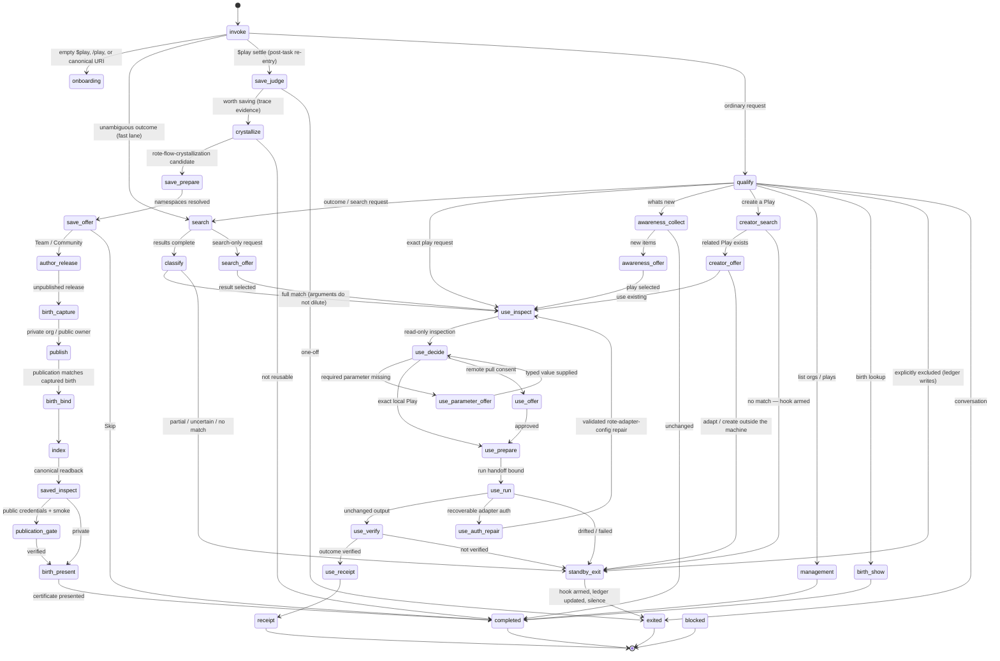

# Play

> Think in terms of Plays before thinking in terms of tools.

Play is the sidekick that makes reusable procedures — **Plays** — the center of gravity of agent
work. It intervenes at exactly two moments and is invisible everywhere else:

1. **Before work** — when you ask for an outcome, Play checks whether a saved Play already does it
   and offers to run it.
2. **After work** — when repeatable work settles, Play judges whether it is worth saving and offers
   to preserve it as a Play.

Everything else — one-off tasks, conversation, creative work — proceeds without Play saying a
word. Stepping aside is a feature: when no adequate Play exists, Play exits silently, arms a save
hook, and lets the agent work normally through the rote skills. A scoped preference ledger learns
where you want Play active ("no Plays while I'm prototyping; always offer them for deploy chores")
from your decisions, without a settings screen.

## The handoff chain: simple skill → state machine → rote skills

Play stays simple by making each layer own exactly one thing and hand the rest down:

| Layer | Owns | Size |
|---|---|---|
| **`SKILL.md`** (the harness contract) | How the agent enters the runtime and handles four yield boundaries: model, human, specialist, terminal. Nothing else. | ~74 lines |
| **`play-machine`** (the typed state machine) | All control flow: classification, search, adequacy, inspection, approval, execution, verification, the save hook, and fail-closed blocking. Policy arrives just-in-time inside each state's projection — the agent never reads the machine. | 70 states, warm transitions <1 ms |
| **rote specialist skills** | All execution with machinery: adapters (`rote-using-adapters`), shell (`rote-shell`), browser (`rote-browse`), workspaces (`rote-workspace`), adapter creation/repair (`rote-adapter-create`/`-config`), orgs (`rote-org`), crystallization (`rote-flow-crystallization`), release (`rote-flow-authoring`), registry (`rote-registry`), setup (`rote-setup`). Play invokes them through typed handoff packets and accepts only validated typed receipts — never prose. | |
| **rote CLI + registry** | The universal Play runner (`rote play run` owns pull, convergence, credentials, execution) and the hub where Plays are shared. | |

The agent's job at any moment is small and local: read one projection, do one bounded thing,
return one declared event. The reasoning-and-reading tax lives in none of the layers.

Two intervention moments also get **structural triggers** — hooks, not prose — because field
testing showed skill descriptions lose to a capable model's directness bias:

- `play-intercept prompt` (UserPromptSubmit): a local-only, ~60 ms match of your prompt against the
  saved-Play index and the cached hub catalog. A hit injects one context line naming the Play; an
  outcome-shaped prompt with no hit injects, at most hourly, one line advising a Play search;
  everything else is silence.
- `play-intercept settle-nudge` (Stop): when a save hook is still armed at turn end, one reminder —
  once per hook per session — to `$play settle <summary>`.
- `play-inbox line` (SessionStart): the zero-token "what's new" inbox line from a
  stale-while-revalidate cache, refreshed in the background.

## Start here

You do not need to remember organization/name slugs or lower-level rote commands. Describe the
outcome in ordinary language:

```text
$play
/play
$play https://play.modiqo.ai/chetan/list-my-github-repos@0.0.2
$play find a Play that retrieves recent emails
$play run the PostHog daily active users report
$play settle deployed staging and posted the summary
$play whats new
$play birth weekly customer report
$play list my organizations and shared Plays
Handle this normally without Play
```

Play keeps each decision separate so every prompt is small and honest:

| You intend to… | Play does… | You choose… |
|---|---|---|
| Ask for an outcome | Search local and authorized indexes; run an adequate Play through inspection and approval | Pull and run, or not now |
| Ask for something with no adequate Play | Step aside silently and arm the save hook | Nothing — the agent works normally |
| Settle finished repeatable work (`$play settle …`) | Judge the trace: parameterizable inputs, repeatable steps, stable output, recurrence | Team, Community, or Skip |
| State a scope preference ("no Plays during prototyping") | Record it in the scoped preference ledger and honor it from the next request | Inspect or revise it any time |
| See what's new | Pull the inbox grouped by organization; compare with the remembered SHA | Run, search, or finish |
| Revisit how a Play was born | Open the owner-private, redacted birth certificate | A name, reference, or birth SHA |

Search selection is never execution approval. Before every run, Play shows what the exact version
does, its parameters, adapters and credentials, what this machine must install or repair, declared
operations and writes, and any unknown effect semantics. Only the next structured choice can
authorize the exact inspected version and displayed parameters.

An empty `$play` or `/play` is a complete warm typed onboarding request, not an empty task. Play
live-probes for Rote and reads the signed-in email with `rote whoami`. A returning user gets the
short personal greeting. A first-time user gets a recommended **Run Hello** choice: public data, no
account, no credentials, no declared writes. Missing or unauthenticated Rote is handed to the
guided `rote-setup` skill. First-use memory is owner-private and deliberately small
(`~/.rote-play/onboarding-state.json`: a hash of the email, orientation version, timestamp —
nothing else).

## The Play state machine

Play is driven by one declarative machine,
[`references/controller/machine.yaml`](references/controller/machine.yaml) (`play.machine/v1`).
The typed runtime loads and validates the bundle once per invocation, executes eligible
deterministic actions until a model, human, specialist, or terminal boundary, and accepts only
events declared by [`actions.yaml`](references/controller/actions.yaml) and
[`prompts.yaml`](references/controller/prompts.yaml). It never jumps states from conversational
intuition. Initial state: `invoke`. Terminals: `receipt`, `completed`, `exited`, `blocked`.



(The diagram groups the onboarding, team-invite, auth-repair, and publication sub-chains for
readability; [`machine.yaml`](references/controller/machine.yaml) is the exact authority.)

There is deliberately **no Explore lane**. Earlier versions of this machine orchestrated
exploration — modality routing, adapter discovery, effect approvals — re-implementing what the
rote skills already own. Today, when no adequate Play exists, Play arms the save hook and steps
aside; the agent works normally through rote; and `$play settle` re-enters for the save judgment.
Fewer states, fewer bespoke entry paths, fewer places for bugs to hide.

State ownership is explicit: `play` owns invocation classification, prompts, evaluators,
deterministic verification, and the standby/ledger writes; `rote-specialist` states
(`crystallize`, `author_release`, publication, `management_list`, team/org actions) are delegated
through typed `play.handoff/v1` packets and validated `play.handoff-receipt/v1` receipts;
`flow-runtime` owns `saved_inspect`, `publication_credentials`, and `publication_smoke` via
first-class Rote surfaces. `tests/controller/test_machine_conformance.py` fails when the machine,
actions, prompts, or the thinking-orbs presentation mapping drift.

Three evaluator (model) boundaries remain in the whole machine: request qualification (ledger-
aware), creator classification, and the save-worthiness judgment. An adequate local Play with
bound parameters runs with **zero** model and zero human yields — one runtime call to the receipt.

### Typed controller runtime

The executable controller lives in
[`scripts/lib/play/controller.py`](scripts/lib/play/controller.py). It compiles the authoritative
Play YAML into [`python-statemachine`](https://python-statemachine.readthedocs.io/) 3.2, while
retaining Play's machine, action, prompt, context, and handoff contracts as the source of truth.
The runtime provides typed cursors and events, context-schema validation, bundle-SHA binding,
derived guards, mutation semantics, checkpointed `play.context/v1`, terminal enforcement, and
per-step timing. [`runtime_actions.py`](scripts/lib/play/runtime_actions.py) executes safe
deterministic commands without shell interpolation and loops until the next evaluator, prompt,
specialist, or terminal boundary.

The automatic runner owns every deterministic action state. The harness sees only model judgments,
human prompts, exact Rote specialist handoffs, and terminal results. The complete context is
checkpointed in an owner-private, 24-hour continuation store under `~/.rote-play/continuations`;
stateless CLI calls exchange only a random 24-character continuation ID.

Install the locked dependencies and inspect the compiled bundle:

```bash
uv sync
uv run scripts/bin/play-machine describe --json
printf '%s' '{"run_id":"demo","task_key":"demo","request":{"original":"Review this repository"}}' \
  | uv run scripts/bin/play-machine run-until-yield --stdin --json
```

Measure controller-only latency with `just benchmark-controller` and `just benchmark-runtime`.
The 2026-08-07 baseline (Apple Silicon, Python 3.14.5, then 87 states) recorded one-time compile
at 76–82 ms, warm transitions at 0.58 ms median / 0.78 ms p95, and the full invoke-to-evaluator
loop at 54 ms; the machine has since shrunk to 70 states and the ~4 KB activation skill replaced a
34.9 KB model-owned controller manual. Treat these as development baselines, not cross-machine
guarantees.

## Install Play everywhere

If Rote skills are already available to your harnesses, install Play with one command:

```bash
curl -fsSL https://raw.githubusercontent.com/modiqo/play/main/install.sh | sh
```

The installer detects Codex, Claude Code, Kimi, and Cursor commands on the machine. It checks that
each detected harness can see the Rote skill provider before writing anything, copies the packaged
Play skill to `~/.local/share/modiqo/play/skill`, links it into every detected harness root, applies
the reversible Play-first activation profile, verifies every link, verifies the `play-machine`
launcher, and checks every required bundled `play-*` entrypoint. Existing unmanaged paths are never
replaced. Updates keep the same stable install path so harness links do not drift between versions.

To get checkbox-ready target data for an agent harness, or a readable checklist in a terminal:

```bash
scripts/harness/install-all targets --json
scripts/harness/install-all targets
```

The target payload is a multi-select over Codex, Claude Code, Kimi, and Cursor, including whether
each harness command, Play skill, and Rote skill provider is present. Apply the exact selected set
with repeated flags (unselected harnesses are outside the resulting activation profile):

```bash
scripts/harness/install-all install --harness codex --harness claude
# Or intentionally target every supported vendor root:
scripts/harness/install-all install --all-harnesses
```

If a selected target lacks `rote` or a `rote-*` skill, installation fails before writing and points
back to that harness's `rote-setup` flow.

### Full Play + Rote bootstrap

For a fresh or partially configured machine, use the transactional, idempotently retryable
bootstrap. Its read-only plan
ranks detected harnesses, selects the top K, records the current Rote version and identity status,
and assigns an immutable plan ID:

```bash
scripts/bin/play-bootstrap plan --top-k 3
scripts/bin/play-bootstrap plan --top-k 3 --json
```

Apply the exact reviewed plan by ID:

```bash
scripts/bin/play-bootstrap apply --top-k 3 --plan-id sha256:<plan-id>
```

If Rote is absent, apply stops with an approval-required report. After the user approves executing
the official remote installer, resume with `--approve-remote-installer`. If Rote is present, apply
runs `rote self-update --yes`. It then converges the complete personal Rote skill distribution with
`rote install skill --provider all --personal --package '*'`, installs the durable Play copy into
the selected harnesses, and merges Play's pre-prompt, post-stop, and session-start hooks into
Codex, Claude Code, and Cursor while preserving unrelated hooks. Kimi is reported as unsupported
for native command hooks rather than treated as successful.

Every hook file changed by bootstrap gets a run-specific backup. Every run writes owner-private
JSON and Markdown reports under `~/.local/state/play-bootstrap/runs/` (or
`PLAY_BOOTSTRAP_STATE`), including selected and skipped targets, Rote before/after state, commands,
hook backups, verification results, human actions still required, and restart guidance. Login is a
human/browser gate: when identity is not verified, the run finishes as `action_required` and
directs the harness to continue through the now-installed `rote-setup` skill. After that handoff
completes, generate and apply a fresh convergence plan. Bootstrap never puts credentials in the
report.

The download uses HTTPS, rejects unsafe archive paths and links, and removes its temporary files.
For a pinned release, set `PLAY_INSTALL_REF` to a tag when invoking the same script. To inspect the
small bootstrap before running it:

```bash
curl -fsSLo /tmp/install-play.sh \
  https://raw.githubusercontent.com/modiqo/play/main/install.sh
less /tmp/install-play.sh
sh /tmp/install-play.sh
```

From a checkout, use the same detection and verification without downloading anything:

```bash
just package
just plan
just install
just verify-profile
```

`just install` links the checkout, so edits become live after a harness restart. `just install-copy`
exercises the durable-copy path used by the curl installer.

## Install from a marketplace

Play is packaged as one self-contained plugin under `plugins/play`. The package includes the skill,
controller references, Python runtime, harness activation tools, and the `justfile` recipes that
configure and verify the Play-first experience. `scripts/bin/package-plugin --check` prevents those
installed files from drifting from this repository's source of truth.

The Rote skill provider is a prerequisite so Play can hand missing local installation to the
guided `rote-setup` specialist:

```bash
# Codex
codex plugin marketplace add modiqo/rote-skills
codex plugin add rote-onboard@rote-skills

# Claude Code
claude plugin marketplace add modiqo/rote-skills
claude plugin install rote-onboard@rote-skills
```

After Play is installed, the `play-machine` launcher is on `PATH`; harnesses invoke it directly
without locating the skill directory or its Python environment. `play-machine` is a Python
entrypoint, not a compiled artifact: the installer writes a small executable launcher that uses the
pinned environment (bootstrapping through `uv` when needed). The preflight distinguishes a missing
launcher, an incomplete bundled runtime, an unavailable Python environment bootstrap (`uv` or an
already active pinned environment), a missing Rote CLI, missing Rote skills in the active harness,
authentication, and `rote play` capability; it also reports cross-harness coverage and
multi-select repair targets. An empty `$play` or `/play` probes
the local binary and identity. If either
is missing, Play invokes `rote-setup`; that specialist asks before downloaded installer code, login,
credentials, or optional onboarding. Ordinary requests are lexically classified and qualified
first; only Play-bound evaluator events run the full preflight, so excluded conversation and
repository work do not pay the identity/capability probe.
Public Play URIs can still show their read-only public card before the CLI exists.

Install Play from its public marketplace after Rote setup:

```bash
codex plugin marketplace add modiqo/play
codex plugin add play@play-skills

claude plugin marketplace add modiqo/play
claude plugin install play@play-skills
```

This checkout is also a valid local marketplace:

```bash
# Run from this repository root.
codex plugin marketplace add .
codex plugin add play@play-skills

claude plugin marketplace add .
claude plugin install play@play-skills
```

The public marketplace source is `modiqo/play`, so `.` can be replaced with that GitHub
`owner/repository` from outside this checkout. Claude's manifest declares the `rote` plugin as a
dependency from the separately trusted `rote-skills` marketplace; every harness still uses the same
runtime preflight because plugin metadata alone cannot prove CLI installation or login state.

### Kimi and other AGENTS.md-standard harnesses

Kimi has no plugin marketplace. It discovers skills from AGENTS.md-standard roots — the shared
`~/.agents/skills` directory and per-harness `~/.<harness>/skills` roots. Install Play for Kimi
from this checkout:

```bash
just plan
just install
```

`install` discovers every supported local harness and every skills root containing Rote skills —
including `~/.agents/skills` — links this Play skill into each, and applies the activation metadata in
[`agents/openai.yaml`](agents/openai.yaml) (`allow_implicit_invocation: true`) so Play stays
implicitly invocable and the rote specialists remain model-invocable for chained handoffs. Play's
structured prompts map to Kimi's `askquestion` control
(`scripts/bin/play-question <prompt> --harness kimi`), and `just harness kimi` /
`just smoke kimi` start and smoke-test the harness like Codex and Claude Code.

Restart the harness after plugin installation. On first use, Play runs the bundled preflight. To
make Play the preferred implicit entrypoint while keeping installed `rote` specialists
model-invocable for chained handoffs, preview
and apply the bundled reversible activation profile from the installed skill directory:

```bash
just plan
just install
just verify-profile
```

In marketplace mode this profile does not create a second Play link. It snapshots and updates the
activation metadata of discovered `rote` skills so the harness can follow chained handoffs.
Uninstall restores those exact snapshots and fails closed if a managed file was subsequently
changed.

## Update an installed Play plugin

After a new Play release is pushed, refresh the marketplace snapshot and reinstall/update the
plugin. Published changes must carry a new plugin version; a push that keeps the same version is not
a reliable cache invalidation mechanism.

For Codex:

```bash
codex plugin marketplace upgrade play-skills
codex plugin add play@play-skills
```

For Claude Code:

```bash
claude plugin marketplace update play-skills
claude plugin update play@play-skills
```

Restart the harness and start a new conversation after updating so it loads the refreshed skill. If
you enabled the implicit Play-first profile, run the following from the newly installed Play skill
directory to converge its reversible activation metadata after the plugin refresh:

```bash
just install
just verify-profile
```

Kimi and other AGENTS.md-standard roots (`~/.agents/skills`, `~/.<harness>/skills`) have no plugin
cache to upgrade; they always follow the source-checkout path below. If you use a cloned source
checkout instead of the GitHub marketplace — or need to refresh those AGENTS.md roots — update from
the repository root with:

```bash
git pull --ff-only
just package
just update
```

Then restart the harness and begin a new conversation. `just package` refreshes the self-contained
marketplace payload; `just update` safely reapplies and verifies the source-linked Play-first
profile.

## Enable from a source checkout

Preview every harness root and canonical rote skill that will change:

```bash
just plan
```

Activate the Play-first profile and verify it:

```bash
just install
just verify-profile
```

After editing the source skill, confirm that every source-linked installation is still valid:

```bash
just update
```

The links make source edits live immediately; a running harness must still be restarted to reload
the revised skill.

`install` detects Codex, Claude Code, Kimi, and Cursor, discovers their skill roots containing
`rote` or `rote-*`, links this Play skill into each root, and makes every Rote skill model-invocable so specialist handoffs can
continue without another user command. It snapshots the original Rote activation files so the
change is reversible. Restart running harnesses after enabling the profile.

It is also the convergence command after `rote harness setup`, a plugin refresh, or a newly added
harness. If Rote replaced managed skill files, `just install` preserves those refreshed files as the
new uninstall baseline and reapplies only Play's activation metadata. It adds new roots/skills and
retires removed ones without restoring stale backups. A changed or conflicting Play link still
fails closed.

Inspect the active profile at any time:

```bash
just status
just status-roots
```

## Start and test a fresh harness

Start a supported interactive harness after verifying the profile:

```bash
just harness codex
just harness claude
just harness kimi
```

Start a compact Codex session without changing global Codex configuration:

```bash
just harness-quiet
```

This launch sets `model_verbosity="low"`, `model_reasoning_summary="none"`, and
`hide_agent_reasoning=true` as per-session overrides. It reduces model narration and reasoning
events; the Codex UI may still render tool calls that were actually made.

Run a read-only smoke test that must reach Play's search-and-step-aside boundary:

```bash
just smoke codex
just smoke claude
just smoke kimi
```

Run every locally installed supported smoke-test harness with:

```bash
just smoke-all
```

Smoke tests start new harness processes and may consume model credits.

## Everyday Play commands

Find by outcome across local and authorized remote indexes:

```text
$play find a Play that retrieves recent emails
$play search live status for AI services
$play run the PostHog DAU report
```

For a vague `run` request, Play searches and offers recognizable names. For an exact reference, it
skips search but never skips inspection or approval. A registry-only result is labeled as available
in an authorized organization and expected to need a local pull/install. The first-class run later
performs that convergence after approval; Play does not manually assemble pull and Flow commands.

List organization and registry inventories:

```text
$play list orgs
$play list plays
$play list
```

Create, save, and share without memorizing lifecycle commands:

```text
$play create a reusable weekly customer report
$play settle built the weekly customer report end to end
Handle this normally without Play
```

Play always searches before creating. If an adequate Play exists it offers **Inspect existing** or
lets you adapt outside the machine. If none exists, Play arms the save hook and steps aside — the
agent does the work normally through the rote skills, with rote's own workspace capture recording
the evidence. When the work settles, `$play settle <one-line summary>` re-enters the machine and
the save-worthiness judge examines the **trace, not the conversation**: at least two effect-bearing
steps, at least one input that would vary on reuse, a stable output shape, and a recurrence prior.
A worth-saving verdict leads to one offer:

- **Team** — release and publish to an authorized private organization, then offer colleague
  invites through `rote-org`;
- **Community** — release and publish under a selected public owner, verify associated adapter
  credential contracts, then run the exact public URI once from an isolated directory;
- **Skip** — keep the result without publishing or indexing a Play.

Execution ownership stays with the rote skill suite end to end: crystallization with
`rote-flow-crystallization`, release with `rote-flow-authoring`, publication with `rote-registry`.
Play never re-implements those flows; it validates each specialist's typed receipt and blocks on
mismatch — a specialist cannot claim success in prose.

One save-time caveat Play discloses honestly: browser-derived (DRIVE) work has a crystallization
limit. Typed browser steps carry navigation, waits, clicks, typing, and canonical extract slices
only; an outcome whose required facts exceed those slices can crystallize only as a legacy stepless
body, which `rote play run` rejects (`play_run_eligible: false`) — a publication gate requiring
explicit approval. See the
[DRIVE crystallization limit](references/explore/modalities.md) and the
[RCA that motivated it](docs/rca/2026-08-05-drive-crystallization-not-play-run-eligible.md).

After release, Play captures a private birth certificate from the exploration evidence. After
Private or Public publication, it binds that certificate to the minted exact reference, then indexes
and inspects the canonical version before calling the save successful. The final typed Python
renderer frames the verified certificate with the Play URI, X and LinkedIn copy for Public Plays,
and a redacted trace-learning summary showing explicit successes, errors, and unknown outcomes. It
closes with a personalized thank-you to the human domain expert. Organization membership,
invitations, and sharing use the organization/list surface rather than hidden local state.

Release and publication are deliberately separate specialist handoffs. `rote-flow-authoring` must
stop after an explicitly unpublished local release. Play then captures the immutable birth object,
and only a fresh `rote-registry` handoff may publish that exact artifact while echoing the captured
birth SHA. If a broad registry publication request publishes early, the machine emits
`publication_boundary_violated` and blocks instead of treating a registry summary as completion or
offering a retrospective certificate.

Public namespace resolution also happens before release. The typed
[`play-public-owner`](scripts/bin/play-public-owner) probe reads the claimed Rote profile handle and
authorized organizations, distinguishes those two identity kinds, and inserts a bounded summary
into the save prompt. Public owner selection is completed before `author_release`; a later generic
CLI hint to claim a handle cannot trigger a redundant `rote profile set-handle` attempt. If the
probe is unavailable, Private and Skip remain available while Public fails closed.

### Public credential and canonical-run gate

A successful registry push is not enough for a Public Play. After canonical readback, Play uses
[`scripts/bin/play-publication-gate`](scripts/bin/play-publication-gate) to compare every associated
adapter across three Rote-owned views:

- the exact Play resolver's selected source, credential demand, and receipt status;
- the installed adapter's version, fingerprint, auth family, and credential binding names;
- the selected registry adapter's published version, fingerprint, and auth contract.

Source/provenance, version, fingerprint, auth family, and environment-variable names must agree.
This deliberately catches contracts such as local `GITHUB_API_TOKEN` versus published `GH_TOKEN`
even when the two adapters have the same fingerprint. The checker handles static credentials and
OAuth-family metadata, but never reads, hashes, prints, copies, or persists a token value.

Only after that metadata check passes does Play invoke exactly one
`rote play run <registry-returned-versioned-uri> <verified-parameters> --yes` from a fresh temporary
working directory under `/tmp`. The temporary directory is removed afterward. Controller context
retains only status, hashes, byte count, and elapsed nanoseconds—not the smoke run's primary output.
This proves that the canonical URI resolves and runs with the current host's Rote/credential setup;
it does not prove every consumer already has the required credentials.

A mismatch, missing credential, provenance failure, or unsuccessful run blocks Play-page links,
social copy, and congratulations. The gate does not silently pull or republish an adapter, change
`token_env`, authenticate, delete transaction backups, or retry. Remediation stays with the
appropriate Rote skill, after which the canonical gates run again. See the
[GitHub token-env incident RCA](docs/rca/2026-08-06-github-token-env-var-confusion.md).

Open or verify how one of your Plays was born:

```text
$play birth weekly customer report
$play show how modiqo/weekly-customer-report was born
scripts/bin/play-birth show modiqo/weekly-customer-report@1.0.0
scripts/bin/play-birth list --json
scripts/bin/play-birth verify weekly-customer-report --json
scripts/bin/play-birth capture --workspace weekly-report-build --flow weekly-customer-report --json
scripts/bin/play-birth bind <birth-sha> --reference modiqo/weekly-customer-report@1.0.0 --json
```

Birth certificates live under `~/.play/births`, independently of `.rote`. They are readable only by
the local OS user, content-addressed, and captured once per released Flow fingerprint. They preserve
safe counts, explicit success/error/unknown outcomes, timings, dependency edges, modalities, token
savings, artifact hashes, and the minted URI’s registry-supplied publication author provenance while
excluding raw commands, parameters, queries, responses, credentials, and workspace paths. They are
not uploaded to the registry and do not follow a Play to another machine. See
[`references/publish/birth.md`](references/publish/birth.md) for capture, binding, privacy, and
lookup semantics. Normal users need only `$play birth …`; capture and bind are controller-owned
lifecycle commands shown here for diagnostics and integration testing.

Open the externally read-only Play inbox:

```text
$play whats new
$play whats new this week
$play digest                       # compact command alias
scripts/bin/play-digest --remember --days 1 --json
scripts/bin/play-digest --since 2026-08-03T00:00:00Z --json
scripts/bin/play-digest --checkpoint host-checkpoint.json --json
scripts/bin/play-digest --org modiqo --days 7 --json
scripts/bin/play-public-trends --play modiqo/hello@0.1.0 --json
scripts/bin/play-public-trends --org modiqo --workers 8 --json
```

“What’s new” is intentionally framed like an inbox. It groups new and revised Plays by organization
and shows each Play’s title, publication author when provenance supplies one, short description,
visibility, timestamp, and canonical reference. It then shows the top 10 public Plays in authorized
organizations ranked by lifetime downloads. Public JSON cards are fetched concurrently, grouped by
their declared organization or user owner kind, and show both lifetime downloads and installs.
Registry and public cards do not currently expose run counts or windowed counter changes, so the UI
never calls cumulative totals runs or trending activity. The reusable report records per-card and
batch fetch latency.

Selecting a card enters read-only inspection before execution approval. Publication authors are
display metadata; Play does not equate an author string with the current signed-in identity. Ranking
scope and missing global, run, or personal metrics are explicit rather than inferred. The emitted
checkpoint token can be persisted by an authorized host for gap-free daily delivery; the command
does not write host state unless `--remember` is explicit.

On normal `$play whats new` requests, Play uses remembered mode. It stores only a stable awareness SHA,
UTC checkpoint, and authorized-scope contract in `~/.rote-play/digest-state.json`. If the current
snapshot has the same SHA, the next response is simply “Nothing new since your last Play check.”
The moving time window is excluded from the SHA, and no inbox contents or credentials are stored.

### The zero-token inbox and structural hooks

The inbox also has a proactive, zero-token surface. A background refresh caches both tiers —
a precomputed one-line summary and the full digest with rendered markdown — plus the authorized
hub catalog, under `~/.rote-play/inbox-cache.json`:

```bash
play-inbox refresh --if-older-than 6   # background-job body; skips when fresh
play-inbox line                        # instant; prints one line or nothing
play-inbox details                     # cached full inbox, no network
```

Wire it stale-while-revalidate at session start (no daemon or cron): the hook serves the previous
refresh instantly and detaches the next one. The line counts only unseen items — the interactive
digest owns the acknowledgment checkpoint, so viewing "what's new" quiets the banner on its own.

The same hook surface carries the interception loop:

```bash
play-intercept prompt        # UserPromptSubmit: local + hub-catalog match, one line or silence
play-intercept settle-nudge  # Stop: one reminder per armed save hook per session
```

Hook state (index cache, cooldowns, nudge markers, preference ledger, standby hooks) lives in
shared `~/.rote-play/` stores, so the safeguards compose across harnesses: a Play saved from one
harness is an interception candidate in every other, and nudges never double-fire.

Cache lifecycle: `just install` kicks one detached warm-up refresh, and every session start
re-refreshes when the cache is older than six hours — no cron, no manual sync. Without an
installed, authenticated Rote every tier degrades to silence: the refresh fails quietly, the
catalog stays empty, and the interceptor's advice line becomes the onboarding funnel (play skill →
Rote probe → guided `rote-setup`). The first refresh after sign-in populates the catalog with
everything the new identity is authorized to see.

Recurring delivery is optional and must be explicitly requested. Its host-neutral two-phase
contract remains available for an authorized scheduler:

```bash
scripts/bin/play-scheduler-probe
scripts/bin/play-delivery prepare --target-key daily-self --channel harness --days 1
scripts/bin/play-delivery release --envelope envelope.json --ack delivered-ack.json
```

The host scheduler owns recurrence, destination delivery, and storage. `prepare` emits an immutable
envelope with a deterministic delivery ID; `release` emits the next checkpoint only for a matching
successful acknowledgment and never persists it. Failed sends therefore leave the prior checkpoint
unchanged. Play never installs or fabricates a scheduler as part of an on-demand digest request.

Search normalizes punctuation and repeated terms, runs both sources concurrently, deduplicates
aliases and versions by canonical Play reference, and shows a URI, local availability, and the next
read-only inspection command for every registry-addressable result.

The organization view shows active member, private Play, public Play, and total counts. The Play
view groups private and public Plays under each authorized organization. An ambiguous `$play list`
request presents both views as structured choices supported by the active harness.

For diagnostics or integrations, the same reusable building blocks are available directly:

```bash
scripts/bin/play-public-trends --play modiqo/hello@0.1.0 --json
scripts/bin/play-search recent emails --json
scripts/bin/play-inspect warsaw-rust/posthog-dau-report@0.0.3 --json
scripts/bin/play-run --stdin --json
scripts/bin/play-run-output --stdin --json
scripts/bin/play-inventory --json
scripts/bin/play-handoff prepare --stdin --json
scripts/bin/play-handoff verify --stdin --json
scripts/bin/play-birth show weekly-customer-report --json
scripts/bin/play-birth verify weekly-customer-report --json
scripts/bin/play-question approve_play_run --harness codex
scripts/bin/play-question approve_play_run --harness claude
scripts/bin/play-question approve_play_run --harness kimi
```

The question command maps the same prompt and event contract to Codex `request_user_input`, Claude
and Kimi `askquestion`, or a numbered Markdown fallback. `play-inspect` normalizes the complete
`rote play inspect <reference> --json` result into a stable disclosure. After approval, the
controller passes the bound inspection and approval packet to `play-run`. That universal runner
performs exactly one `rote play run <canonical-uri-or-exact-reference> <approved-parameters> --yes`
and emits the typed controller event. It does not delegate execution to a prose skill, rediscover
the Play, resolve a local path, replay the command to capture output, or ask the harness to construct
a receipt.
Unambiguous outcome verbs route directly from invocation to parallel Play search without a model
qualification or harness preflight round trip. Canonical URIs accept explicit `key=value`
parameters; inspection deterministically elicits any remaining required values before pull consent.
It uses `rote play` for local Play operations and `rote registry play` for registry distribution and
registry-scoped discovery. It never uses legacy Flow command aliases or decomposes a failed Play
operation into a manual pull-plus-run fallback.

### Unchanged run output

Successful Use-mode execution passes the complete primary payload directly from `use_run` to
`use_verify`. Play retains the declared source, format, manifest, truncation flag, and full-output
reference but does not render or convert the payload. The harness owns presentation.

After verification, the receipt computes integrity and byte-count metadata over the unchanged
primary value and returns that same value to the harness. Compact or summary-only output cannot be
verified as a complete result; truncated output requires a full-output reference.

After a new Play is released, Play captures its owner-private birth object. After publication, it
binds the object to the registry content hash, indexes the Play, reads the canonical registry entry
back with JSON inspection, verifies its owner/version/visibility, and only then presents the typed
certificate and reports success. A `play_published` event alone is always intermediate.

## Optional thinking-orbs UI

React-capable hosts can use the adapter in `ui/thinking-orbs` to render
[`thinking-orbs`](https://orbs.jakubantalik.com/) from the authoritative Play machine state:

```bash
just ui-install
just ui-check
```

```tsx
import { PlayActivity } from '@modiqo/play-thinking-orbs';

<PlayActivity playState="creator_search" />
```

The mapping uses all nine animations for distinct trajectories: listening for declared prompts,
searching for discovery, solving for classification and verification, connecting for existing-Play
inspection/execution, weaving for multimodal exploration, shaping for crystallization, composing
for release/publication, working for result assembly, and breathing for paused terminal states.
Every machine state has exactly one accessible status label, and tests fail if the
machine and mapping drift.

The installed skill also teaches the agent to use the same presentation at meaningful milestones:

```bash
scripts/bin/play-presentation creator_search
# ◌ Peeking through the Play shelves…

scripts/bin/play-presentation use_run --json
# play.presentation/v1 payload for a capable host renderer
```

When a compatible MCP Apps/custom-UI host exposes a callable renderer, `PlayActivity` displays the
animated orb and message. Installing the skills-only plugin does not create that renderer. Codex CLI
and Claude Code text transcripts use the exact static glyph and message without claiming it is
animated. During the blocking `rote play run` command, Rote retains ownership of its own progress
display.

This is an optional host adapter, not a claim that a skill can replace native Codex, Claude Code,
Cursor, or Kimi activity chrome. Hosts without a custom React surface continue to receive Play's
milestone-only text updates. The adapter depends on `thinking-orbs` 0.2.0 from Jakub Antalik under
the MIT license; no upstream source is copied into this repository.

## Disable

Remove Play from every managed harness root and restore the exact original rote activation files:

```bash
just uninstall
just status
```

Restart running harnesses after disabling the profile. Uninstall fails closed if a managed Play
link was replaced or a rote activation file changed after installation; it will not overwrite the
newer content silently.

## Development checks

```bash
uv sync
just package
just package-check
just ui-check
just test
just benchmark-controller
just benchmark-runtime
```

The tests exercise the declarative Play machine and the complete activation lifecycle in temporary
harness roots, including installation, verification, idempotency, rollback, and conflict handling.

The foundation is Python-only. Commands under `scripts/bin/` and harness entrypoints under
`scripts/harness/` are thin executables; reusable command, private-store, birth-certificate,
registry, search, inventory, digest, templated elicitation, typed greeting/URI onboarding, typed
specialist handoff, typed controller runtime, public credential/smoke validation, and
machine-validation logic lives in `scripts/lib/play/`. References and tests are
grouped by controller, awareness, Explore, publication, integration, and harness use case.

For isolated testing, override the discovered roots or reversible state location:

```bash
PLAY_HARNESS_ROOTS=/path/one:/path/two just install
PLAY_PROFILE_STATE=/tmp/play-profile.json just install
```
